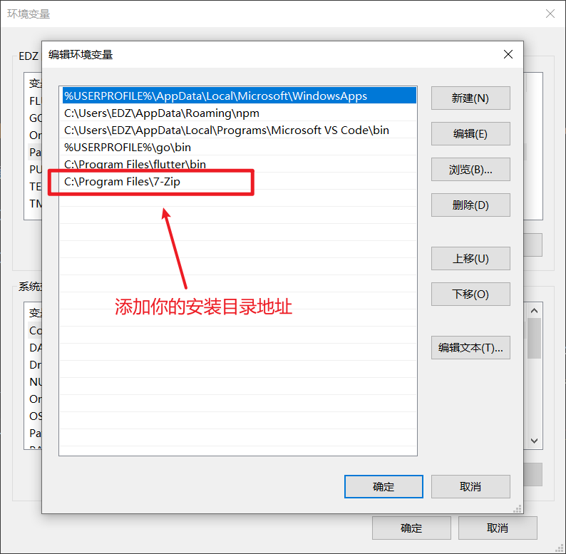

## 关于

[7-Zip](https://www.7-zip.org/) 是一个开放源码的数据压缩程序，主要用在 `Microsoft Windows 操作系统`。

同时又有一个简短的名称 **7z**。

虽然 7-Zip 的 UI 界面不是非常好看，但是丝毫不影响它强大的功能。

并且 7-Zip 支持强大的命令行调用，只需添加入环境变量可直接使用。

## 配置

1. 到官网下载 [7-Zip (点击跳转官网下载页)](https://www.7-zip.org/download.html)

2. 安装完成找到安装目录，复制目录地址，添加入环境变量 `Path` 中就可以在命令行中运行。


添加你的安装目录地址到新建变量中：



完成后重启 `cmd` 运行 `7z` 出现说明文档表示配置成功。

## 使用

配置完成之后可直接在命令行中使用 `7z` 命令压缩或解压缩。

### 解压文件

```shell
7z x {fileName} -o{outputDirectory}
```

- `x` 表示解压
- `{fileName}` 表示文件名称
- `{outputDirectory}` 表示解压后的文件或文件夹名称
- `-o` 表示指定输出路径

如果想直接把文件解压到当前文件夹中，可以不指定 `-o{outputDirectory}`

> 注意：`-o` 与 `{outputDirectory}` 之间没有空格

示例：

```shell
λ ls
1.7z

λ 7z x 1.7z
# 不指定目录，直接解压至当前文件夹

λ ls
1.7z  1.txt
```

### 压缩文件

```shell
7z a {outputFileName} {fileName}
```

- `a` 表示添加文件到压缩档案中
- `{outputFileName}` 表示压缩成功文件名称及格式
- `{fileName}` 表示要压缩的文件或目录

示例：

```shell
λ ls
1.txt

λ 7z a 1.7z 1.txt
# 压缩 1.txt 到 1.7z 文件中

λ ls
1.7z 1.txt
```

将 `test` 文件夹中所有文件添加到 `test.7z` 文件中，并且不会包含 `test` 文件夹前缀：

```shell
7z a test.7z .\test\*
```

> 此案例可以找一个多层文件夹嵌套目录测试。

### 删除压缩文件中的特定内容

```shell
# 删除压缩文件内所有 .txt 文件
7z d {fileName} *.txt -r
```

- `d` 表示从压缩档案中删除文件
- `{fileName}` 表示压缩档案
- `*.txt` 表示所有的 .txt 文件
- `-r` 递归，检索包含内部所有文件夹中的内容

### 常用参数列举

- a：将文件添加到压缩档案中
- d：从压缩档案中删除文件
- e：将压缩档案中的所有文件解压到指定路径，所有文件将输出到同一个目录中
- l：列出压缩档案的内容
- rn：重命名压缩档案中的文件
- t：测试压缩档案的完整性
- u：更新要进入压缩档案中的文件
- x：将压缩档案中的所有文件解压到指定路径，并包含所有文件的完整路径

上述为 7z 命令常用参数，可供参考。

[本文部分参考自 walter lv](https://blog.csdn.net/WPwalter/article/details/90638622) 感谢解决我的使用问题！
