# GitHub Actions 自动部署

GitHub Actions 由 GitHub 官方推出的工作流工具。典型的应用场景应该是 CI/CD，类似 Travis 的用法。

我的的项目，每次需要手动推送到 GitHub Pages 实在是太麻烦，我们使用 GitHub Actions 就可以自动起来了。

## 一、配置域名

如果推送自己的域名，按以下操作，如果没有域名，直接从二开始即可

域名解析记录中添加一个 CNAME 到 `<user>.github.io`。

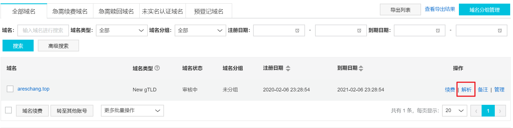

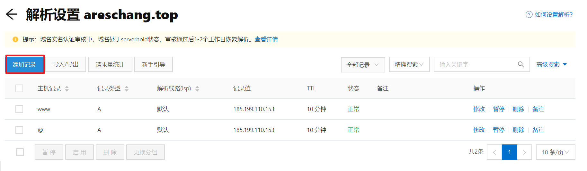

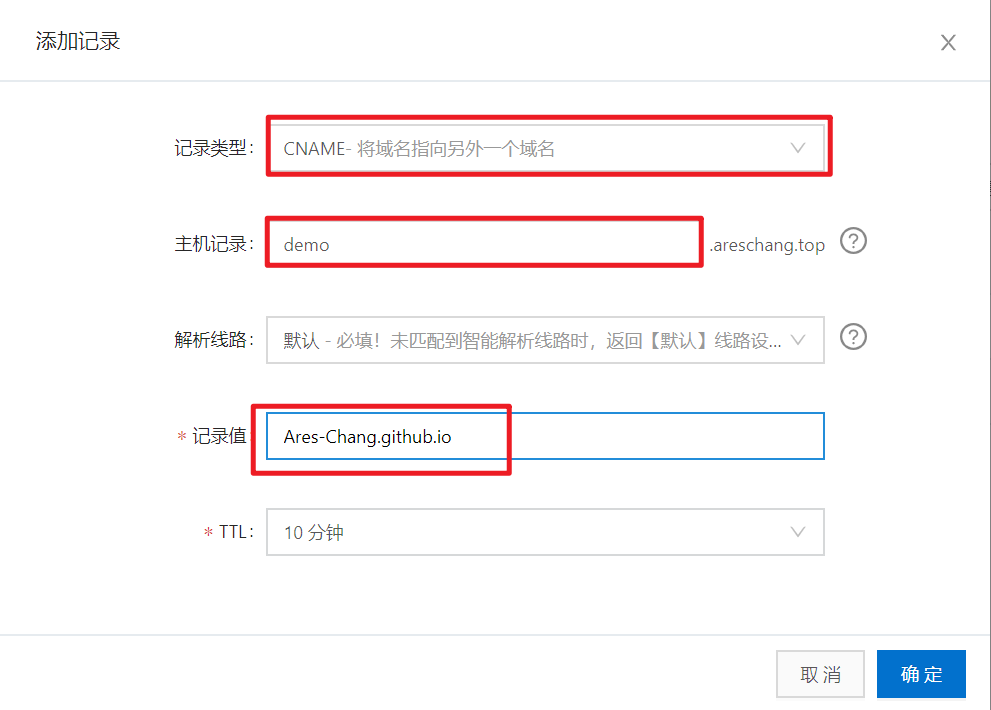

> 记录类型：CNAME
>
> 主机记录：
>
> - `@`: 访问地址：`areschang.top`
> - `www` 访问地址：`www.areschang.top`
> - `demo` 访问地址： `demo.areschang.top`
>
> 解析线路：默认
>
> 记录值：`你的GitHub用户名.github.io`
>
> TTL: 10 分钟，默认的

然后在项目的 `public` 目录中添加一个文件 `CNAME` 写入你的自定义域名

例如：

```
demo.areschang.top
```

## 二、生成 GitHub Token

点击 Settings

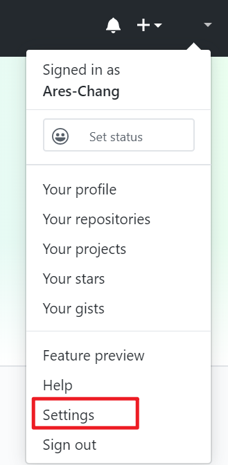

点击 Developer settings

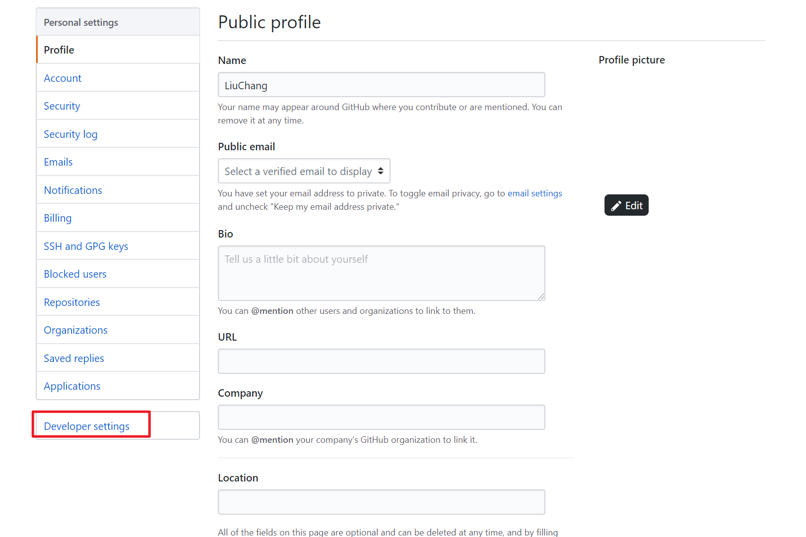

点击 Personal access tokens 生成个人令牌

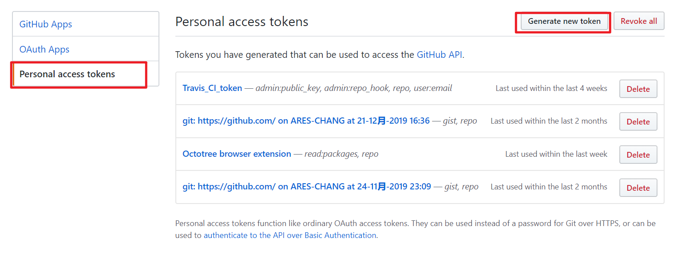

自己取个名字，给予访问权限

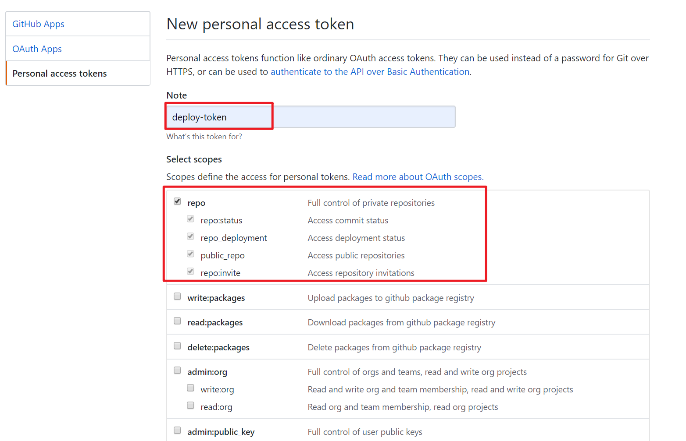

点击确定生成个人令牌

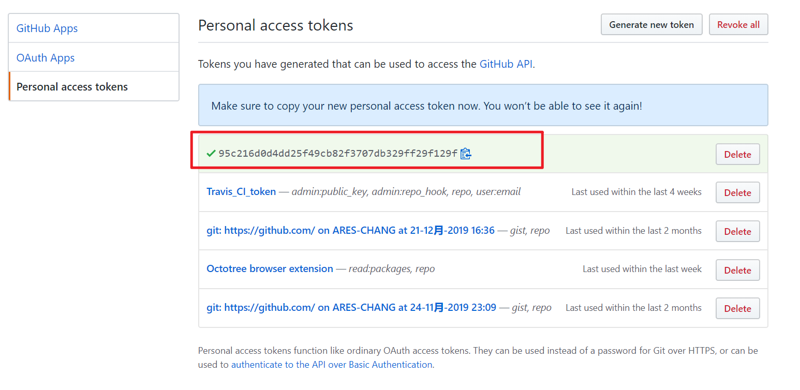

> 注意：这个令牌自己保存好，只会出现一次，如果忘记只能再次重新生成

## 三、将 token 配置到项目的 secrets 中

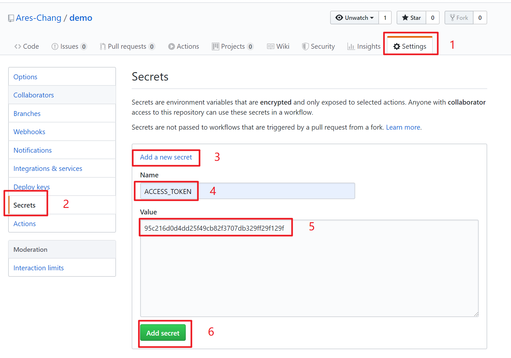

> Name：最好和我的一致，如果你修改了则下面的脚本内容也要修改。
>
> Value：填写上一步生成的那个 token。

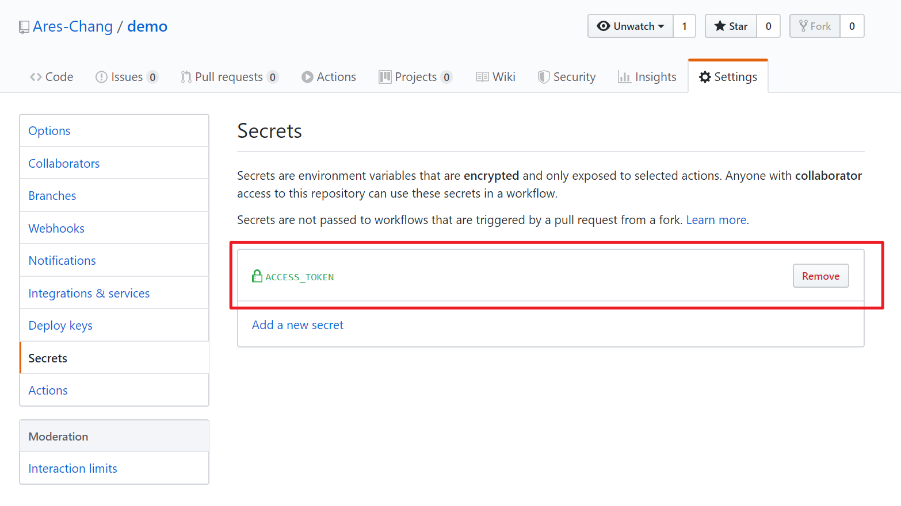

如图，添加成功了

## 四、配置 GitHub Actions

在项目中创建 `.github/workflows/main.yml` 并写入下面的配置内容。

```js
name: build and deploy

# 当 master 分支 push 代码的时候触发 workflow
on:
  push:
    branches:
    - master

jobs:
  build-deploy:
    runs-on: ubuntu-latest
    steps:
    # 下载仓库代码
    - uses: actions/checkout@v2

    # 缓存依赖
    - name: Cache dependencies
      uses: actions/cache@v1
      with:
        path: ~/.npm
        key: ${{ runner.os }}-node-${{ hashFiles('**/package-lock.json') }}
        restore-keys: |
          ${{ runner.os }}-node-

    # 安装依赖
    - run: npm ci

    # 打包构建
    - run: npm run build

    # 发布到 GitHub Pages
    - name: Deploy
      uses: peaceiris/actions-gh-pages@v2
      env:
        // 如果刚刚 name 修改了，这里也要修改为你自己设定的 name
        PERSONAL_TOKEN: ${{ secrets.ACCESS_TOKEN }}
        PUBLISH_BRANCH: gh-pages
        PUBLISH_DIR: ./dist

```

部署需要使用到 npm 安装依赖产生的 package-lock.json 文件，所以需要使用 npm 来安装依赖

## 五、推送源代码

```sh
git add .
git commit -m 'test: GtiHub Pages 自动部署测试'
git push
```

## 六、查看部署状态

<br/>
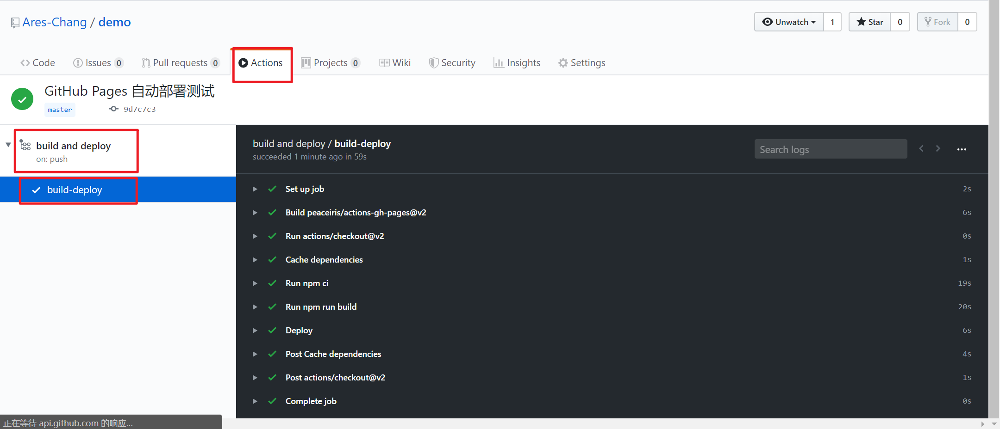

> 当所有的任务都完成变为绿色的对勾之后，就表示本次自动部署成功了。
>
> 当有新的源码 push 推送过来，会再次触发自动部署。
>
> 如果自动部署失败，会有红色的 ×，它还会给你发一封邮件告诉你部署失败了。

## 七、访问网站

部署成功以后，进入 settings 中查看 GitHub Pages 服务是否正常。

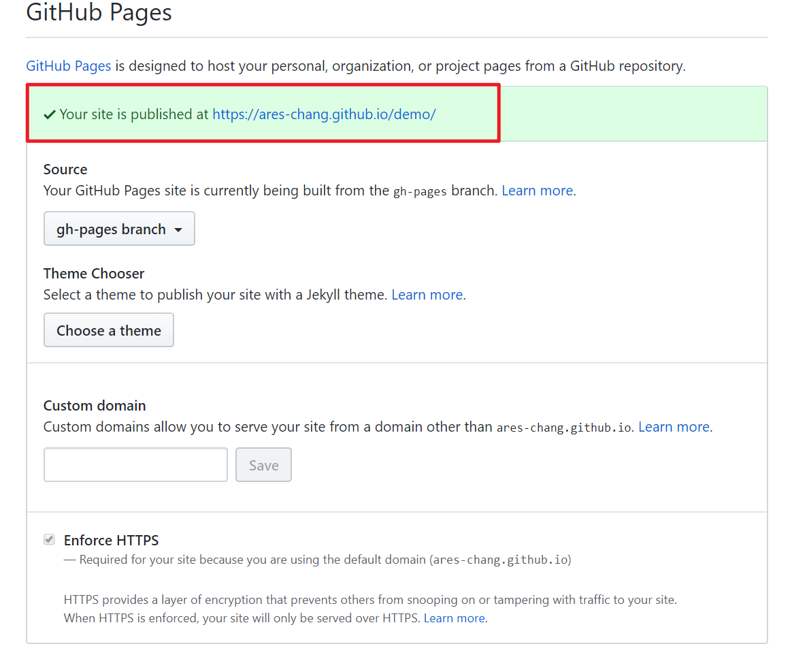

服务正常即可在浏览器中访问你的网站。
