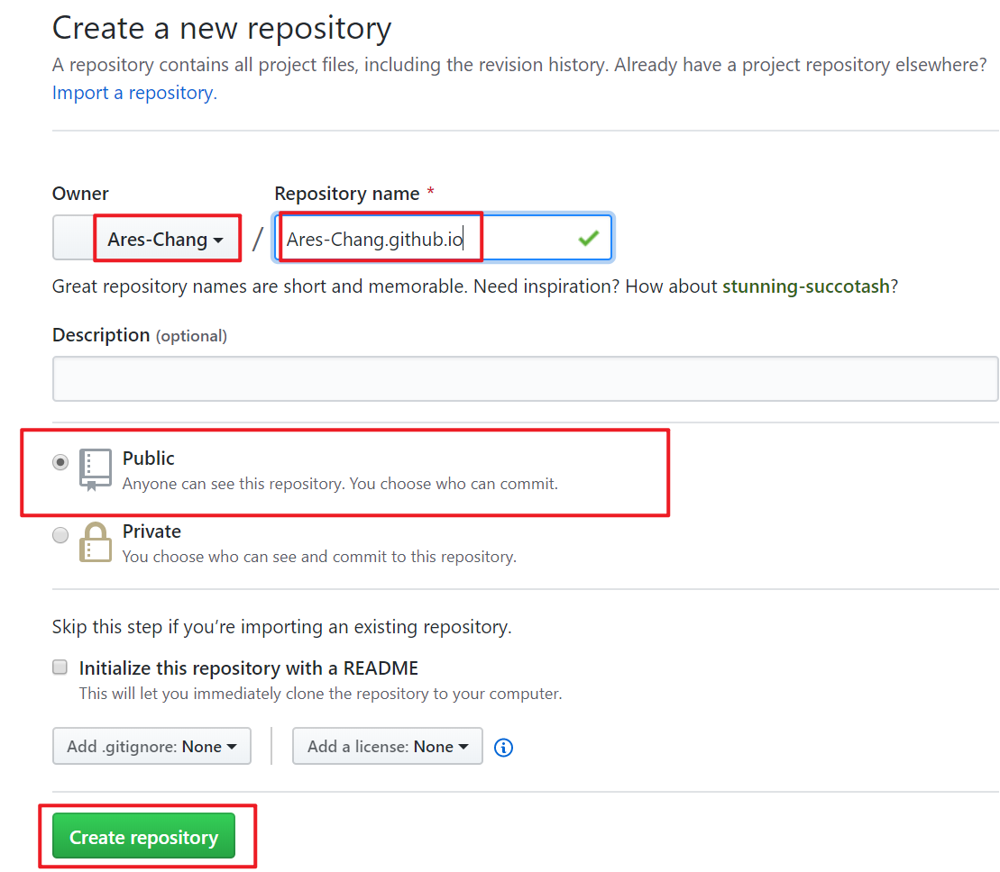
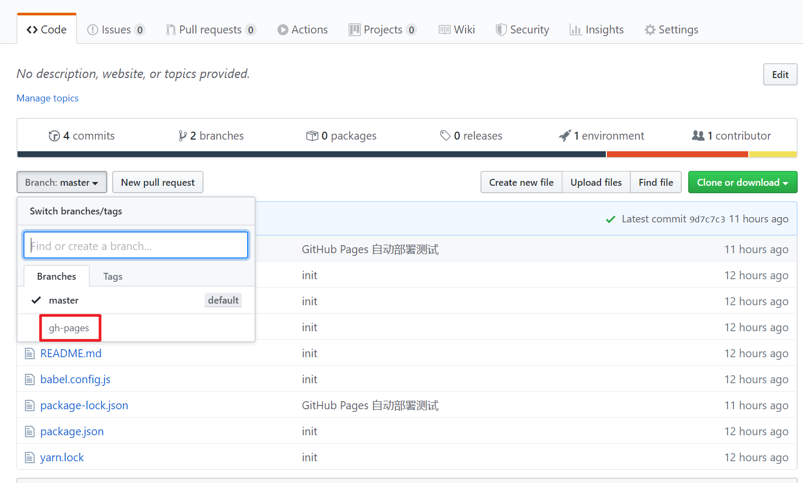
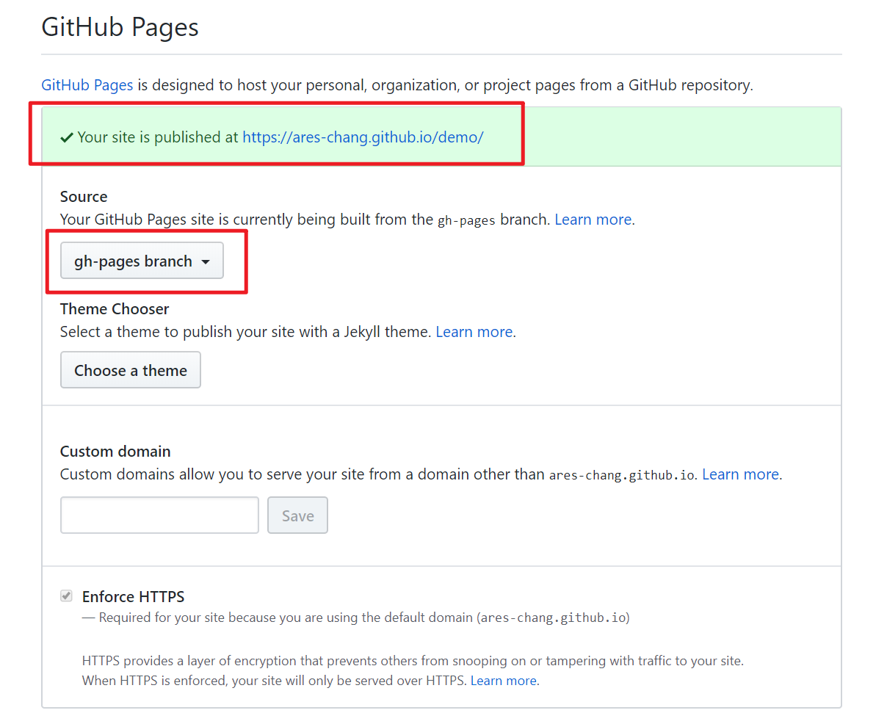

# GitHub Pages

## 介绍

GitHub Pages 是一个静态资源托管服务器，它可来帮我们托管静态网站，这是我们前端开发者们的一个福音，我们可以把我们开发的精美网站或者个人博客托管在 GitHub 上，节省了需要自己搭建服务器的时间。

> Hosted directly from your GitHub repository. Just edit, push, and your changes are live.

## 访问项目域名

- 如果你的仓库名字叫：`<user>.github.io`，则访问地址是：`https://<user>.github.io/`

- 如果是其他的名字，则访问地址是：`https://<user>.github.io/仓库名称/`

- 自定义域名

  - 首先你得有一个域名

  - 然后将你的域名解析到 `https://<user>.github.io/`

  - 在托管的仓库根目录添加一个部署文件

> 提示：GitHub Pages 默认的域名强制开启 https，自定义域名可以选择 http 或者 https。

## 部署项目到 GitHub Pages

如果想把 github 项目部署到 Github Page 上有两种方法。

### 方法一：个人主页

直接在 GitHub 上新建一个名字叫做 `<user>.github.io` 的仓库，user 必须是你的用户名，打包文件 push 到这个仓库中就可以在 `<user>.github.io` 上浏览了。

> PS:要使用 GitHub Pages 公有仓库是免费的，如果要使用私有仓库是收费的

### 方法二：个人仓库

建立一个仓库，名字不重要，但是需要展示的内容必须在 `gh-pages` 分支中才可以

需要 build 的把 dist 目录放入 gh-pages (该分支名具有特殊含义，GitHub Pages 服务的要求)

然后把 gh-pages 分支托管到 GitHub Pages 服务中

托管成功，访问即可。
