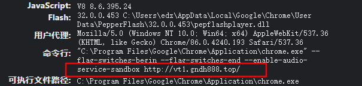

# Chrome 主页被劫持到 hao123

##

昨天下载软件被莫名植入了病毒，Chrome 启动时自动打开 hao123，打开 IE 发现也被劫持了。

当时我这精神小洁癖就受不了了，这严重影响我的办公效率啊。

网上一顿搜索尝试了很多方法，不是常规的 lnk 快捷方式劫持，查询注册表也无果。

打开 Chrome 设置并没有异样，无任何发现，重置和重装浏览器也并不能解决问题。

但是到 chrome://version/ 查看浏览器版本的时候可以发现这么一句话

经确定是直接修改了 Chrome 的命令行劫持主页。

我们打开了浏览器会自动执行这句话，自动跳转到 `http://vt1.gndh888.top/` 这个代理网址，然后再跳转到 hao123

可是这个不是普通的网页劫持，直接写到命令行我们无法消除，但可以肯定的是，这肯定是个病毒。

不过在这里面弄清楚了原理。大致上就是有个木马，劫持了 explorer 这个程序，每次打开浏览器的时候，就会通过 explorer 给浏览器发送命令，打开他指定的网页，所以在浏览器上无论你做什么都是没用的。

既然是病毒，我们就安装个杀毒软件来杀一下毒，看能不能解决掉。

我尝试安装了腾讯电脑管家，火绒安全来杀毒，但是都没有检测出病毒。

最后我在网上找到了这篇帖子 [https://zhuanlan.zhihu.com/p/258918747](https://zhuanlan.zhihu.com/p/258918747)，老哥也是个深受毒害的可怜人，抱着一试的心态，安装了 [360 急救箱](http://weishi.360.cn/jijiuxiang/index.html)。

事实证明，只有魔法才可以打败魔法，成功检测出两个病毒。

删掉，重启，完美解决浏览器主页劫持问题。

但是 360 同时把我的启动项和系统快捷指令给优化了一下，都给我删了 😭

不过这个相对于病毒来说都不是问题。

虽然平常都在说 360 是"流氓软件"，怎么怎么不好，但是遇到事情还是这种"流氓操作"更加的靠谱！力挺！
