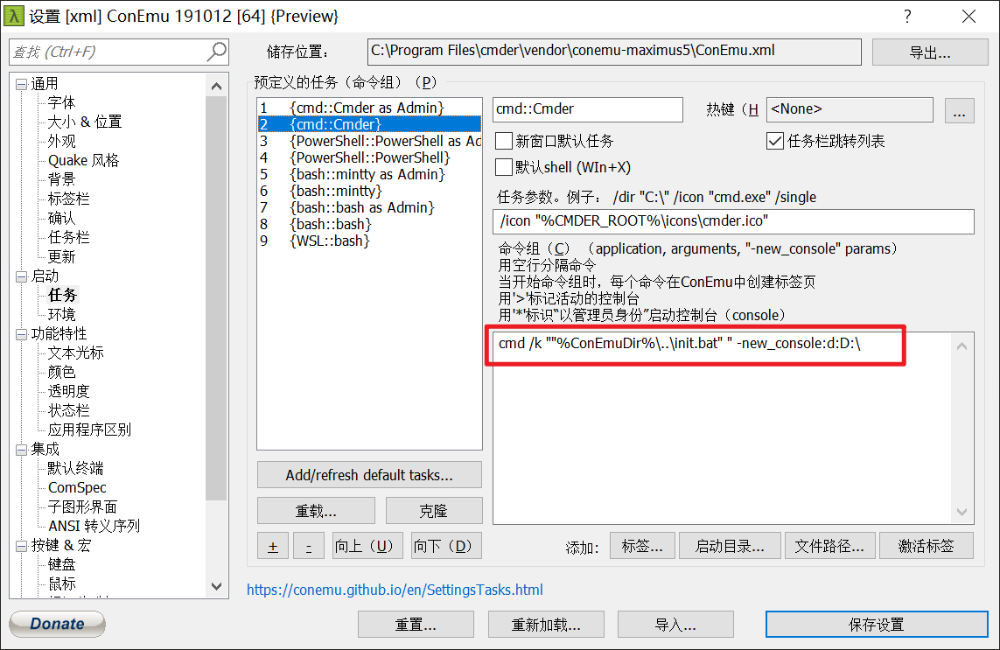

# Cmder 高级应用

## 介绍

为了让 cmder 命令行使用起来丝滑,我们需要自己来配置一下来让它更加的好用。

## 更改启动位置

cmder 默认打开是在安装位置，但是我想要自定义它的启动位置，所以做了以下操作。

1. 打开 cmder 设置（win + alt + p）

启动 > 任务 > 选择 > 找到你要修改的 bash 添加修改以下语句

```batch
cmd /k ""%ConEmuDir%\..\init.bat" " -new_console:d:D:\
```



再次重启程序，启动地址就已经改变了。

## 自定义 aliases 命令

cmder 还增加了 alias 功能，它让你用短短的指令执行一些常见但指令超长又难以记忆的语法;比如 ls cls 等等

打开 cmder 安装目录下的\config\user-aliases.cmd 文件

下面是 cmder 自带的一些命令，你还可以自定义你常用的命令。

```batch
;= @echo off
;= rem Call DOSKEY and use this file as the macrofile
;= %SystemRoot%\system32\doskey /listsize=1000 /macrofile=%0%
;= rem In batch mode, jump to the end of the file
;= goto:eof
;= Add aliases below here
e.=explorer .
gl=git log --oneline --all --graph --decorate  $*
ls=ls --show-control-chars -F --color $*
pwd=cd
clear=cls
history=cat -n "%CMDER_ROOT%\config\.history"
unalias=alias /d $1
vi=vim $*
cmderr=cd /d "%CMDER_ROOT%"
~= cd /d %userprofile%\Desktop
```

- e. 打开当前路径文件夹

- gl 打印 git log 记录

- ls 列出当前路径下的文件相当于 dir

- pwd 打印出当前绝对路径

- clear 清空当前屏幕上的命令

- history 打印历史命令

- vi 打开 vim

- cmderr cd 到 cmder 安装路径文件夹

- ~ cd 到桌面文件夹
