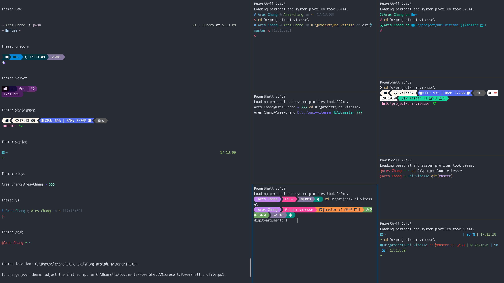

# Oh My Posh

## 关于

[`Oh My Posh`](https://ohmyposh.dev/) 是一个适用于任何 `shell` 的自定义命令提示符，能够使用函数或变量调整提示字符串。

类比于 `Win` 版本的 `Oh My Zsh` ，同样可以美化终端全其更加易用。



以下会介绍 `Oh My Posh` 的安装及配置。

> 以下配置基于 `Windows Terminal` 及 `PowerShell` 配置，想要了解更多可以参考 [PowerShell](./power-shell.md)。
>
> 如果使用其它终端或要了解 `Oh My Posh` 的更多配置信息，请参考 [官方文档](https://ohmyposh.dev/)。

## 安装

打开 `PowerShell` 提示符并运行以下命令:

```bash
winget install JanDeDobbeleer.OhMyPosh -s winget
```

要使用 `Microsoft Store` 版本的 `Oh My Posh`（它将在新版本可用时自动更新），请使用以下命令：

```bash
winget install XP8K0HKJFRXGCK
```

输入 `oh-my-posh version` 以确认你的 `Oh My Posh` 安装版本号。

为确保拥有最新的更新，可以使用以下命令：`winget upgrade oh-my-posh`。

## 安装 Nerd Font

`Oh My Posh` 被设计为使用 `Nerd` 字体。如果你的字体不包含相应字形，则在整个提示符中，你可能会看到若干 `Unicode` 替换字符“`▯`”。

所以，如果你想要更好的字体效果，请安装 [`Nerd Font`](https://ohmyposh.dev/docs/installation/fonts)。

> 如果您对使用 `Nerd Font` 不感兴趣，可考虑使用包含 `minimal` 功能的 `Oh My Posh` 主题，指示不需要额外的图标。

### 下载

`Oh My Posh` 有一个 `CLI` 可以帮助您选择和安装 [Nerd](https://www.nerdfonts.com/) 字体（测试版）：

::: warning
该命令最好以**管理员**身份执行，以便在系统范围内安装字体。如果您没有管理员权限，您可以通过添加 `--user` 标志来安装字体。请注意，这在使用某些应用程序时可能会产生副作用。
:::

```bash
oh-my-posh font install
```

> 推荐使用官方推荐的 `Meslo LGM NF` 字体。[点击此处下载 .zip](https://github.com/ryanoasis/nerd-fonts/releases/download/v3.0.2/Meslo.zip)。

### 应用

安装 `Nerd Font` 后，您需要配置 `Windows` 终端才能使用它。

通过从 `Windows` 终端下拉菜单中选择 `设置(Ctrl+,)` 来打开 `Windows` 终端设置 `UI`。

选择要应用字体的配置文件（例如 `PowerShell`），然后选择 `外观` 选项卡。在 `字体` 下拉菜单中，选择 `MesloLGM Nerd Font` 或要用于自定义提示符的任何 `Nerd` 字体。

## 主题配置

可以在 [`Oh My Posh`](https://ohmyposh.dev/docs/themes) 主题页面浏览主题的完整列表。

选择主题，并使用此命令更新 `PowerShell` 配置文件。（可以将 `notepad` 替换为你选择的文本编辑器。）

```bash
notepad $PROFILE
```

如果收到路径错误，则你可能还没有 `PowerShell` 的配置文件。

若要创建一个，请使用以下 `PowerShell` 命令创建配置文件，然后尝试再次使用文本编辑器打开它。

```bash
new-item -type file -path $profile -force
```

将以下项添加到 `PowerShell` 配置文件的末尾，以设置 `paradox` 主题。 （将 `paradox` 替换为你选择的主题。）

```bash
oh-my-posh init pwsh --config "$env:POSH_THEMES_PATH\paradox.omp.json" | Invoke-Expression
```

现在，每个新的 `PowerShell` 实例都将通过导入 `Oh My Posh` 并设置命令行主题启动。

如果在尝试打开新的 `PowerShell` 实例时收到脚本错误，则表明 `PowerShell` 执行策略可能受到限制。 若要将 `PowerShell` 执行策略设置为不受限制，则需以管理员身份启动 `PowerShell`，然后使用以下命令：

```bash
Set-ExecutionPolicy -ExecutionPolicy Unrestricted
```

> 这不是你的 `Windows` 终端配置文件。 你的 `PowerShell` 配置文件是一个脚本，该脚本在每次启动 `PowerShell` 时运行。[详细了解 PowerShell 配置文件](https://learn.microsoft.com/zh-cn/powershell/module/microsoft.powershell.core/about/about_profiles)。

## 主题选择

Oh My Posh 附带许多开箱即用的主题。如果您使用的是 `PowerShell`，则可以使用以下 `PowerShell cmdlet` 显示每个可用主题。

```bash
Get-PoshThemes
```

名称中带有 `minimal` 的主题不需要 `Nerd` 字体。

需要了解更多信息，请参阅 [Themes](https://ohmyposh.dev/docs/themes)。
