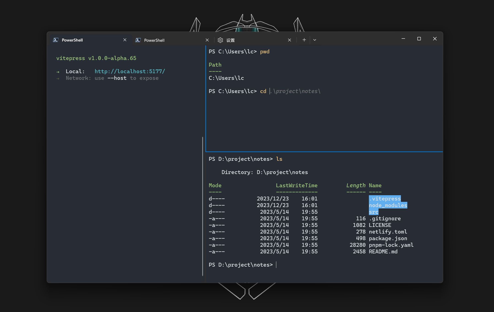

# PowerShell

## 关于

`PowerShell` 是一种跨平台的任务自动化解决方案，由命令行 `shell`、脚本语言和配置管理框架组成。 `PowerShell` 在 `Windows`、`Linux` 和 `macOS` 上运行。

[Miscrosoft PowerShell 文档](https://learn.microsoft.com/zh-cn/powershell/)

## 目的

虽然以前 `Windows Terminal` 及 `PowerShell` 是难看、难用、丑等等的代名词。

但现在微软已经针对 `Windows Terminal` 及 `PowerShell` 作出了改进，已经兼具了好看、易用、及可配置的特性了，可以一试！

以下文章会针对 `Windows Terminal` 搭配 `PowerShell` 进行针对性美化及增强。



## 安装 ❗️

> `Win` 系统内已经内置了 `Windows PowerShell`，但它并不等于 `PowerShell`，这是两个独立的产品。
> 具体可参考 [什么是 Windows PowerShell？](https://learn.microsoft.com/zh-cn/powershell/scripting/windows-powershell/overview?view=powershell-7.4)

有多种方式可以安装，本文使用 `Winget` 安装，其它方法可参考 [安装](https://learn.microsoft.com/zh-cn/powershell/scripting/install/installing-powershell?view=powershell-7.4)。

搜索最新版本的 `PowerShell`

```bash
winget search Microsoft.PowerShell
```

```sh
Name               Id                           Version   Source
-----------------------------------------------------------------
PowerShell         Microsoft.PowerShell         7.4.0.0   winget
PowerShell Preview Microsoft.PowerShell.Preview 7.4.0.101 winget
```

安装 `PowerShell` 或 `PowerShell 预览版`

```bash
winget install Microsoft.PowerShell
# winget install Microsoft.PowerShell Preview
```

## 版本查看

安装成功后重启终端，输入以下查看版本信息。

```bash
$PSVersionTable
```

```sh {3}
Name                           Value
----                           -----
PSVersion                      7.4.0
PSEdition                      Core
GitCommitId                    7.4.0
OS                             Microsoft Windows 10.0.22621
Platform                       Win32NT
PSCompatibleVersions           {1.0, 2.0, 3.0, 4.0…}
PSRemotingProtocolVersion      2.3
SerializationVersion           1.1.0.1
WSManStackVersion              3.0
```

## 设置

### 默认项

点击终端标签页箭头 `设置 -> 启动 -> 默认配置文件` 设置 `PowerShell` 为默认启动项。

保存后，再新建页面会自动使用 `PowerShell` 作为默认配置项。

### 设置全局快捷键

1. 点击 `win` 键，搜索 `PowerShell`
2. 打开文件位置
3. 右键快捷方式，点击属性
4. 配置快捷键 `Ctrl + Alt + T` 或你喜欢的快捷键

### 快捷键设置

`设置 -> 操作`，内可自定义配置操作项快捷键，可以根据自己使用习惯调整。

### 主题配置

可针对不同的 `Shell` 设置不同的主题配置，也可共用默认配置。

点击 `设置 -> 配置文件|默认值`，可自由配置。

文本主题、文字样式、背景颜色、背景图片、亚克力材质、不透明度等等...

## 我的配置

- [我正在使用的](https://github.com/Ares-Chang/use)
- [我的 Windows Terminal 配置](https://github.com/Ares-Chang/.config/blob/master/WindowsTerminal/settings.json)
- [我的 PowerShell 配置](https://github.com/Ares-Chang/.config/blob/master/Microsoft.PowerShell_profile.ps1)
