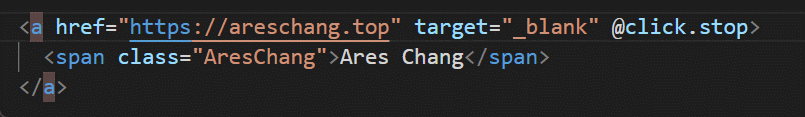
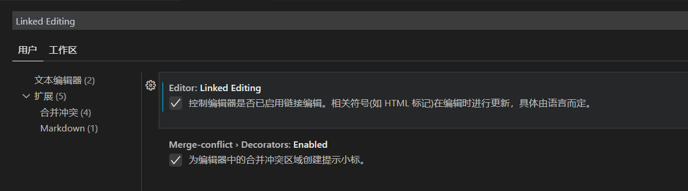

# 关闭 VS Code 标签同步修改功能

## 关于

同标题，记录如何关闭 VS Code 修改首标签，自动修改尾标签功能。

> os: 功能是好的，但是它没有想像中的智能。。。

## 解决方法

自从 VS Code 自动更新打开这个功能后，搭配 Vim 使用，怎么用怎么别扭。

找了好几个方法，也关不掉，也不知道怎么描述，搜索也不准确。

必须狠狠翻设置才能找到，现记录一下：

**打开设置，搜索 `Linked Editing` 关闭此选项**

> os: 起的什么破名字，这描述有语文功底也看不明白呀😭