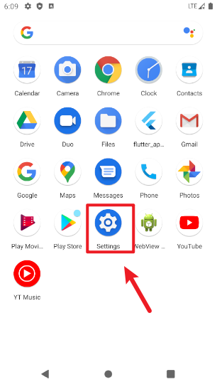
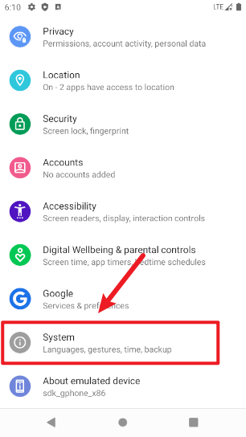
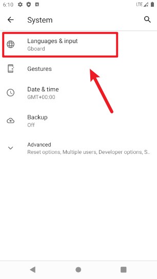
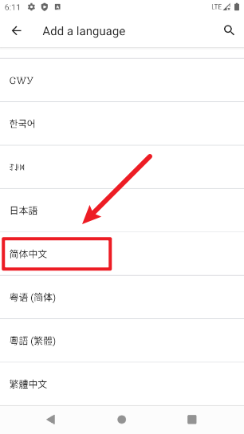

# 模拟器设置为中文

## 问题

Android Studio 创建好模拟器后，系统默认是英文的。

为了方便日后操作，可以设置系统语言为中文。

> 精神洁癖请绕过，放过我这个小渣渣。🤫

## 解决方法

模拟器启动后，在桌面上拉打开应用合集。

> 系统版本不同，具体操作界面可能不同，但大体逻辑相同。

在合集中找到设置(Settings)图标：

打开 Settings 面板后，向下划动找到系统(System)选项:

在系统页面中，找到 Languages & input(语言和输入法)选项:

选择语言(Languages)，如果没有简体中文选项可以点击 Add a language 添加语言：

向下划动，找到简体中文(基本在最下方)，点击添加：

添加成功之后，需要把简体中文拖拽到第 1 项后生效：

