# Flutter 环境搭建

## 历史

Flutter 是 Google 开源的一个跨平台框架，基于 Dart 语法进行开发，需要 [Dart 语法基础](./dart-base-note.md)进行学习使用。

## 安装环境

### 安装 Java JDK

Flutter 环境运行需要基于 [Java JDK](https://www.oracle.com/cn/java/technologies/javase/javase-jdk8-downloads.html)，我下载的时候官网更新，需要注册登录，贴个[其它下载方式](http://jdk.android-studio.org/)

下载完成是个安装程序，直接下一步，下一步就可以了。

安装完成，在 cmd 中输入 `java`，有说明输入，说明安装正确。

### 安装 Flutter SDK

下载安装 [Flutter SDK](https://flutter.dev/docs/development/tools/sdk/releases#windows)。

- 下载成功后是一个压缩包。解压缩后放到一个位置。

- 解压后点击 `flutter_console.bat` 文件就可以运行 flutter ，但是每次进入点击都太麻烦，需要配置环境变量。

- 此电脑，右键点击属性，高级系统设置，环境变量

  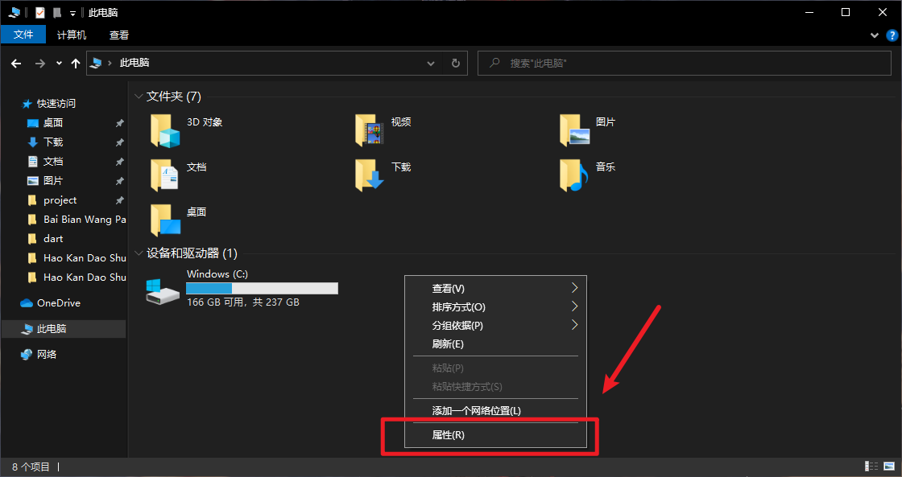
  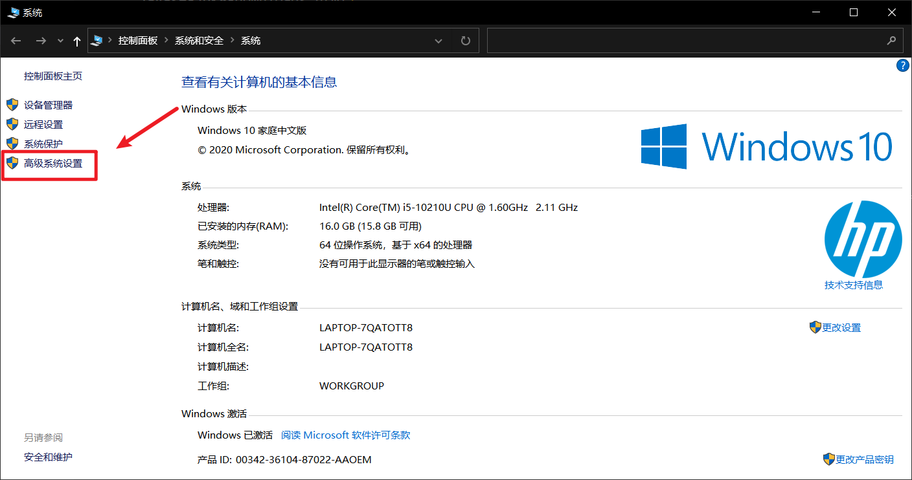
  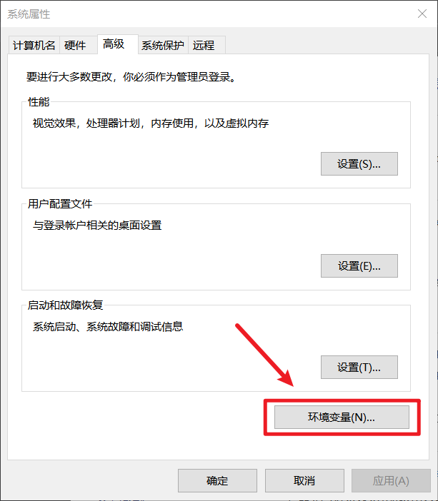
  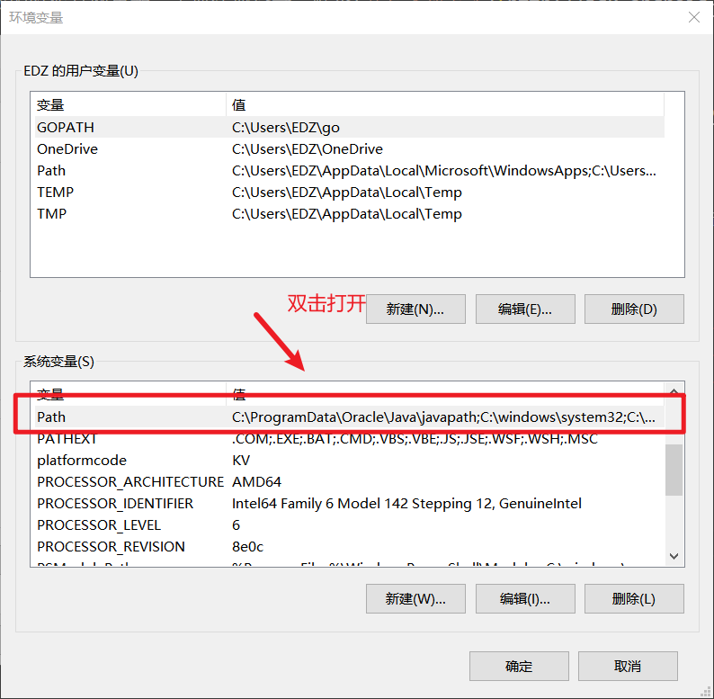
  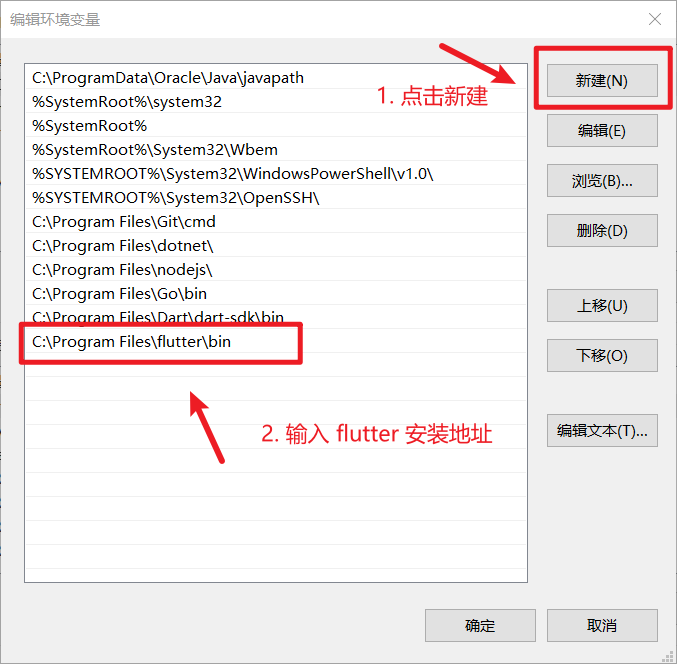

  设置完成，重启电脑，在 cmd 中输入 `flutter -v` 出现说明提示即为设置成功。

### 设置国内镜像

在国内访问 Flutter 有时可能会受限制，如果没有梯子的话，建议修改国内镜像源使用。

将以下环境变量加入到用户环境变量中。

```shell
export PUB_HOSTED_URL=https://pub.flutter-io.cn
export FLUTTER_STORAGE_BASE_URL=https://storage.flutter-io.cn
```

> 注意：此镜像为临时镜像，并不能保证一直可用，读者可以参考详情请参考 [Using Flutter in China](https://github.com/flutter/flutter/wiki) 以获得有关镜像服务器的最新动态。
>
> 或关注 [Flutter 中文网](https://flutterchina.club/setup-windows/) 获取最新配置方案。

- 转到 “控制面板>用户帐户>用户帐户>更改我的环境变量”
- 在“用户变量”下检查是否有名为“Path”的条目:
  - 如果该条目存在, 追加 `flutter\bin`的全路径，使用 ; 作为分隔符.
  - 如果条目不存在, 创建一个新用户变量 `Path` ，然后将 `flutter\bin`的全路径作为它的值.
  - 在“用户变量”下检查是否有名为”PUB_HOSTED_URL”和”FLUTTER_STORAGE_BASE_URL”的条目，如果没有，也添加它们。
- **环境变量设置完成，需要重启以应用此更改**。

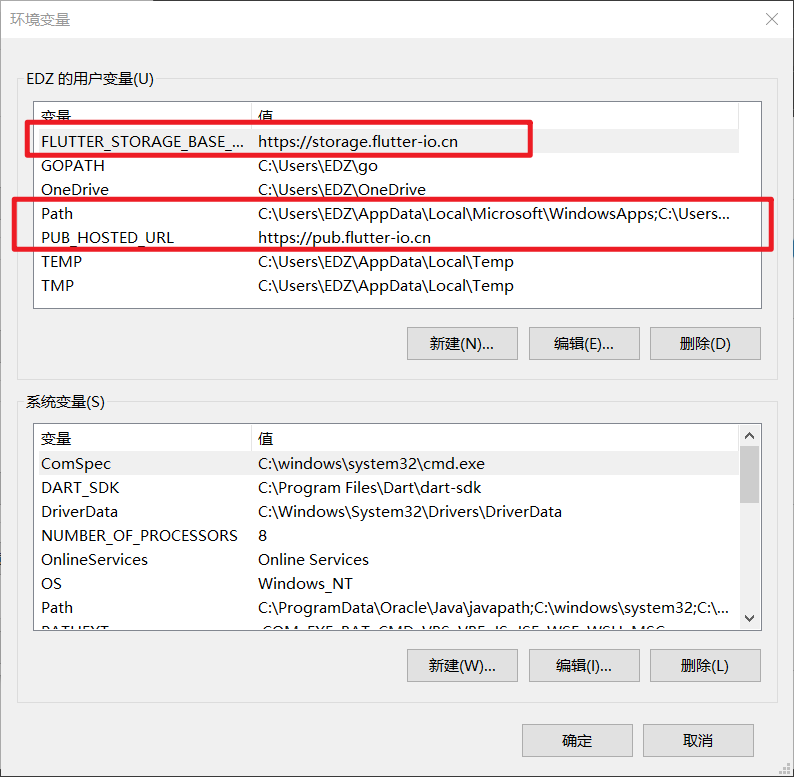

具体图解请看楼上[安装 Flutter SDK](#安装-flutter-sdk)...

安装流程不够具体请查看[Flutter 中文网](https://flutterchina.club/)

### 安装 Android Studio

查看代码展示结果需要 [Android Studio](https://developer.android.com/) 基础运行，网络不通访问不了，贴个[其他下载地址](http://www.android-studio.org/)

下载成功后点击安装，下一步，下一步就可以了。

打开后会出现配置指引，需要按照提示下载 `Android SDK`，**不要一味跳过！！！**

> Android Studio 是不支持中文的，版本一直在更迭，汉化链接不是长期生效。
>
> 如果想要汉化自行百度加载。

### 检测运行环境

> PS: 请优先参照 [Android Studio 开发(一般)](#android-studio-开发-一般)，设置之后再尝试 `Flutter doctor`。否则环境信息会和下图不一样。

在 cmd 中运行 `flutter doctor` 会检测当前运行环境是否完备可运行。

按以上操作步骤安装，运行结果大致如下：

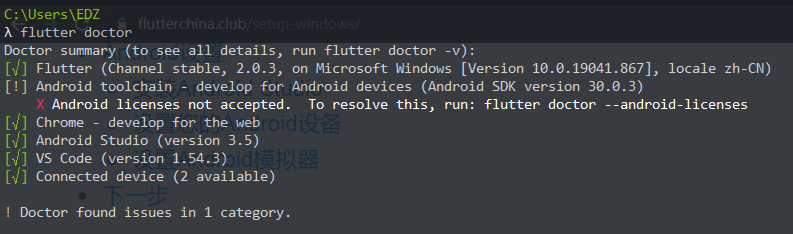

<span style="color: #87b525;">√</span> 代表成功可运行，<span style="color: #b8ac56;">！</span>表示环境存在问题，<span style="color: #ca275f;">X</span> 表示缺少部件。

1. 表示安装 Flutter SDK
2. 表示安装 Android SDK 和 证书
   - 这里缺少安卓证书，按提示输入：`flutter doctor --android-licenses` 安装即可。
   - 下载后会提示一些信息选择，一路按 `y` 就可以。
3. 表示安装 Chrome
4. 表示安装 Android Studio
5. 表示安装 VS Code
6. 表示安装模拟器运行环境或连接设备

## Android Studio 开发(一般)

### 下载插件

点击配置，下载插件，在市场中搜索 Flutter 下载的同时会提示需要一起下载 Dart 插件，点击确认。

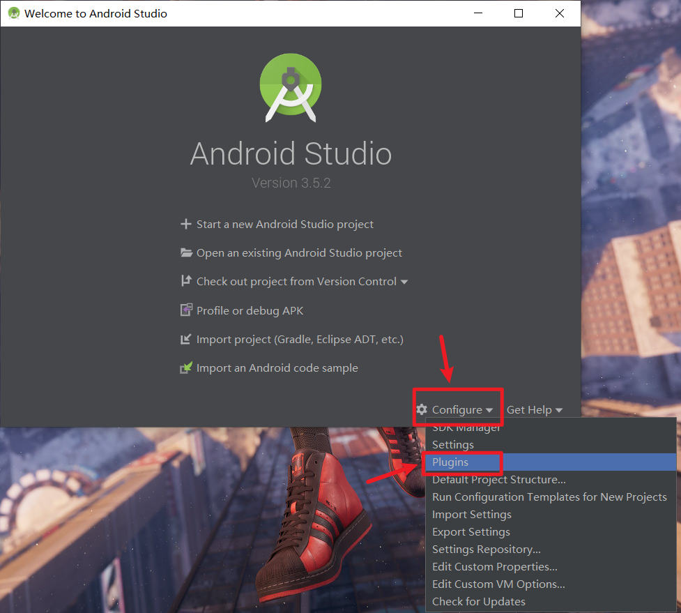
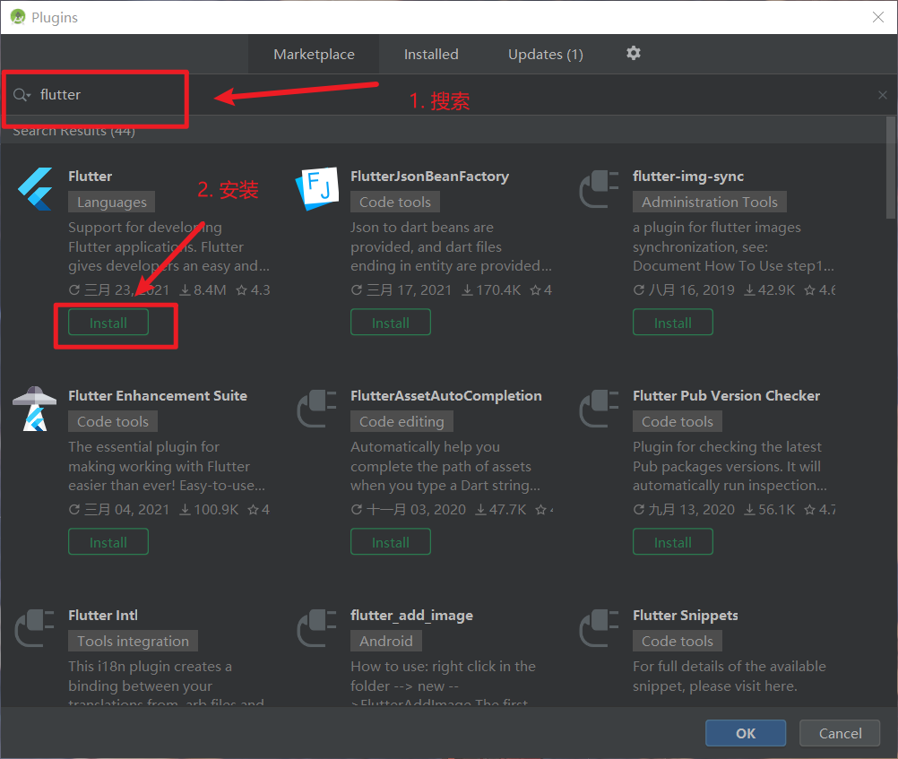

安装完成会提示需要重启 IDE 才能生效，如果没有提示请自行重启。

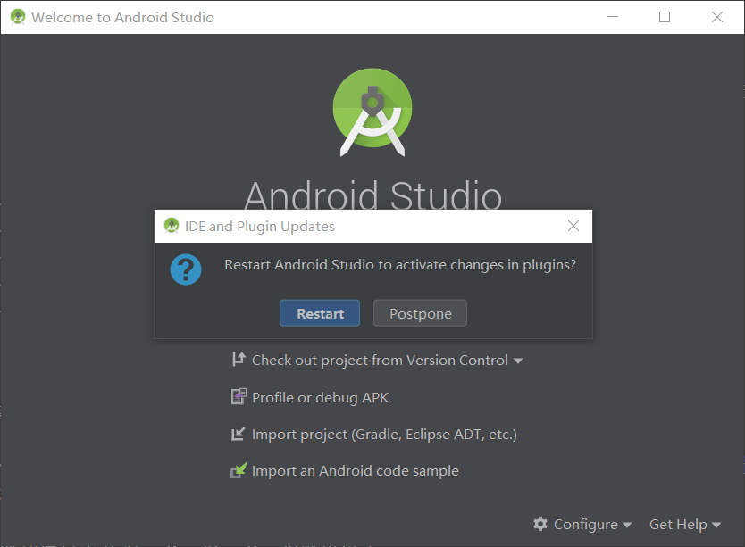

### 新建模拟器

打开 Android Studio 点击 Tools，选择 AVD Manager 新建一个模拟器。

选择一个模拟设备手机型号

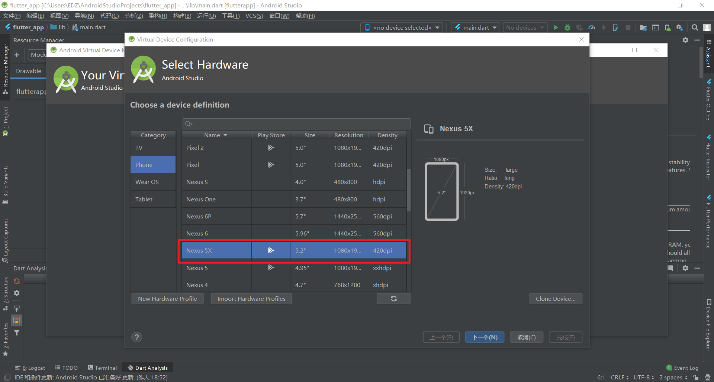

选择一个模拟设备操作系统，如果本机没有，点击 Download 下载。

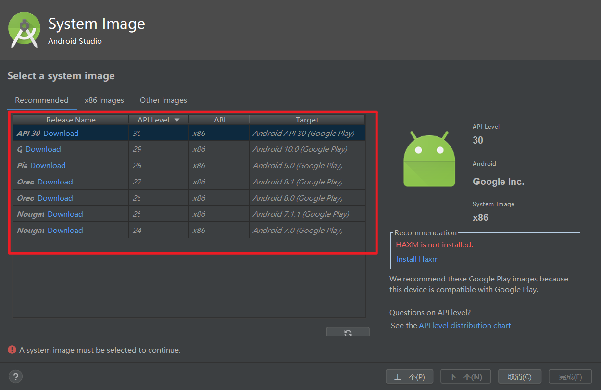

点击下一步新建一个模拟设备。点击运行就可以打开虚拟设备。

> PS: 环境信息设置完毕，如果要回到[检测运行环境，请点击。](#检测运行环境)

### 新建项目

打开 Android Studio 点击新建 Flutter 项目

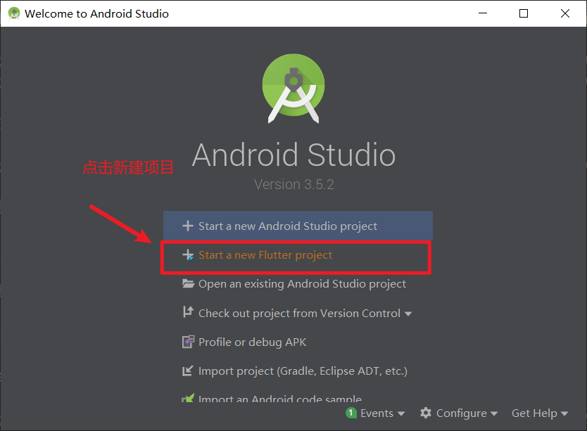
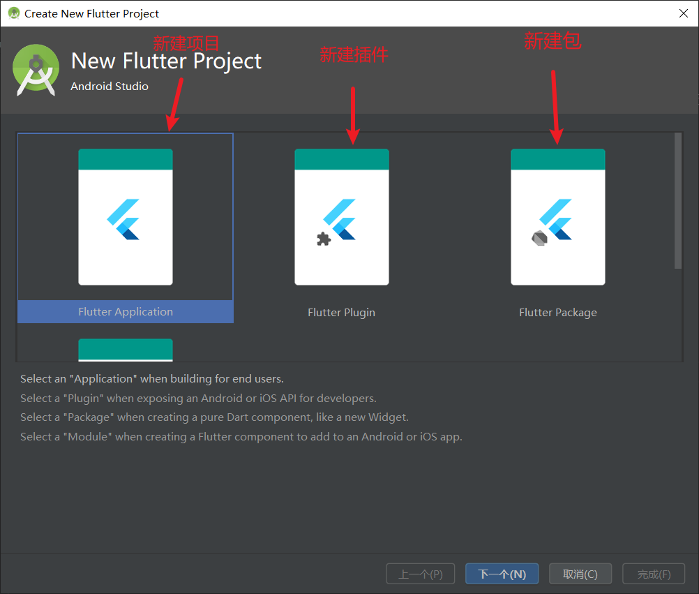
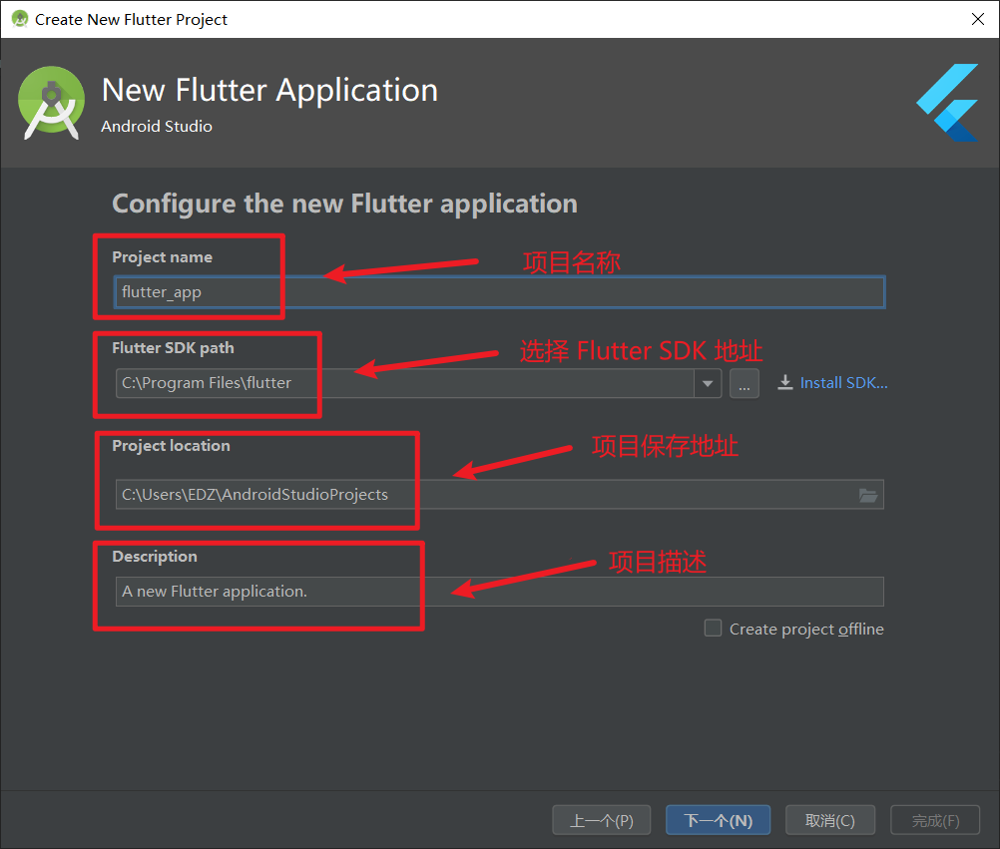

一般 win 都可以自动识别路径，如果地址没有自动选择，请自行选择。

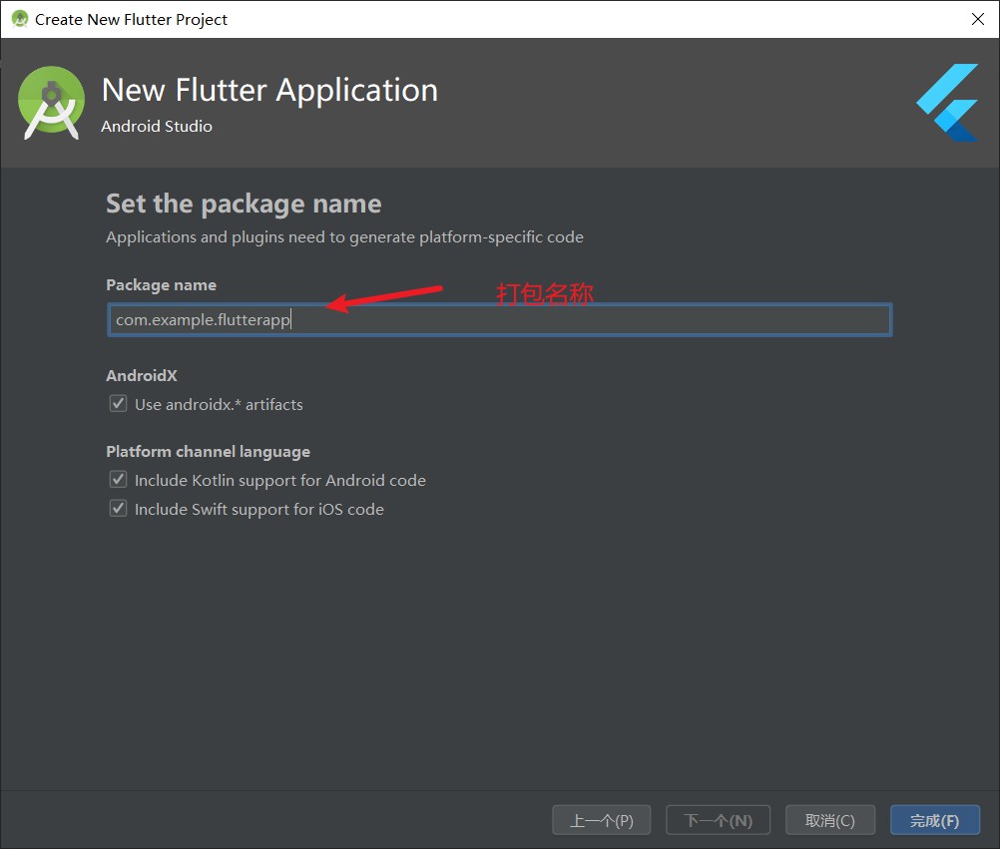

点击完成，等待项目加载完成。

然后点击 Tools ，选择 AVD Manager，启动模拟器，如果没有模拟器，请参照[新建模拟器](#新建模拟器)设置加载。

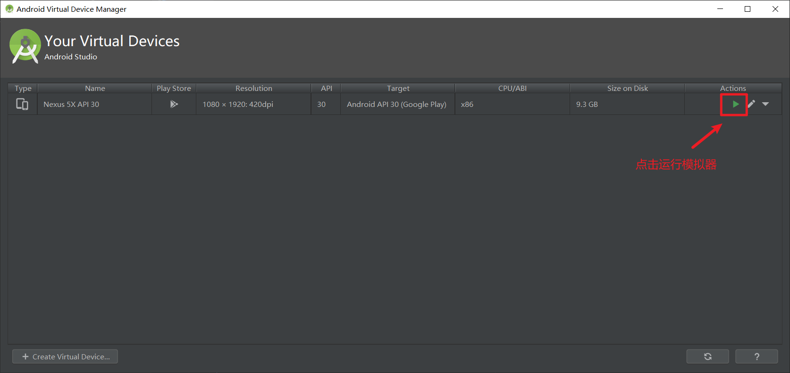

点击运行或 debug 项目，等待底栏加载进度。

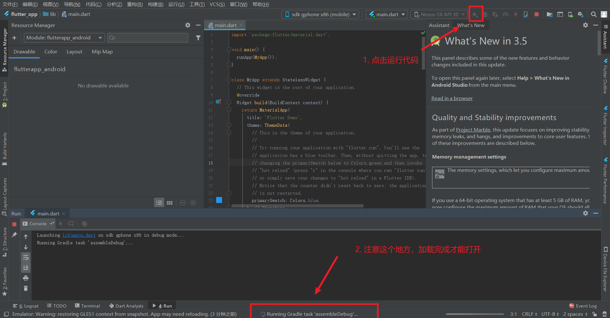

加载完成自动打开模拟器，注意需要手动开机，点击开机按钮。

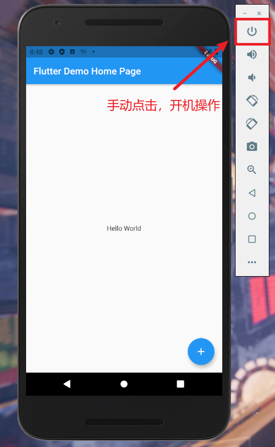

## VS Code 开发(推荐)

Android Studio 的体量太大，对一般电脑太不友好了。幸运的是 VS Code 已经支持了 Flutter 的开发，只需要下载插件支持就可以了。

**如果使用 VS Code 开发，推荐还是要把 Android Studio 安装完成，专业的毕竟是专业的，有的功能是不能模拟的。**

### 下载插件

需要下载以下插件：

- Flutter
- Dart(基本会和 Flutter 捆绑下载，如果没有请自行下载)
- Flutter Widget Snippets (可选，通过简写命令引入一些代码片段)
- Awesome Flutter Snippets (可选，通过简写快速插入组件模板)

### 新建项目

可以通过 Flutter 入门应用模板新建 Flutter 项目：

1. 打开命令面板（`Ctrl+Shift+P` （macOS 用 `Cmd+Shift+P`））。
2. 选择 `Flutter: New Application Project` 命令然后按 `Enter`。
3. 输入你想要的项目名。
4. 选择项目地址。
5. 等待项目生成。

### 运行项目

项目生成成功后会自动引入 SDK，可以按 `F5` 进入运行和调试模式。(默认使用系统浏览器加载)

**带热更新哦~**

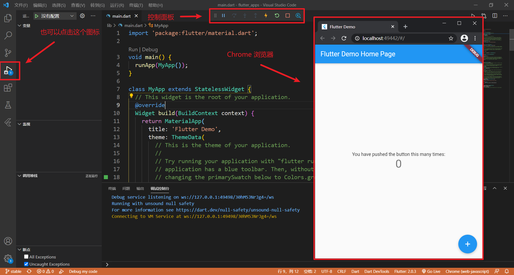

> PS: 运行和调试集成了 `DevTools` 工具，它是一个运行在浏览器中的调试以及性能测试工具集。DevTools 取代了前一代基于浏览器的性能测试工具 Observatory，它包含了以前仅适用于 Android Studio 和 IntelliJ 的功能，例如 Flutter inspector。

### 选择目标设备

当一个 Flutter 项目在 VS Code 中打开，你会在状态栏看到一些 Flutter 特有项，包括 Flutter SDK 版本和设备名称（默认使用系统浏览器，连接真机通用哦~）

点击即可更改启动设备，如果没有安卓模拟器的话，可以参考[新建模拟器](#新建模拟器)，或者连接真机使用。

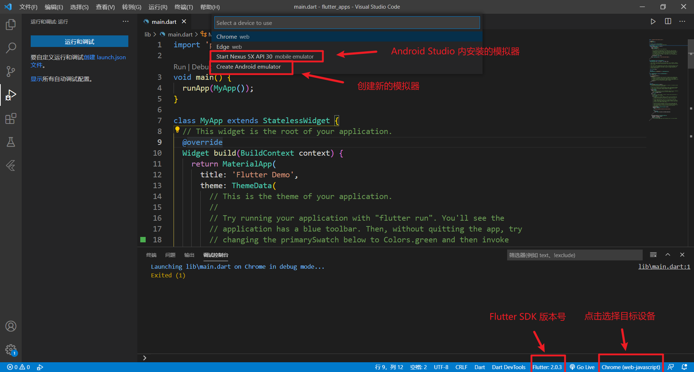

VS Code 中的 `Create Android Emulator` 命令也是走的 Android Studio 中的 AVD Manager 模板信息，如果有需要也可以使用。

::: tip 提示

- 如果你没看到 Flutter 版本号或者设备信息，你的项目可能不被识别为一个 Flutter 项目。请确认 VS Code Workspace Folder 的目录中是否含有 pubspec.yaml。
- 如果状态栏显示无设备表明 Flutter 没有发现任何已连接的 IOS、Android 或者模拟器。你需要连接设备或者启动模拟器。
- Flutter 扩展会自动选择上次连接的设备。
- 如果要删除模拟器可以在 Android Studio 中进行。
  :::

如果还有疑问，也可以参考[Flutter 中文网](https://flutter.cn/docs/development/tools/vs-code)，信息更具体。

## cmd 中运行项目

### 创建项目

Flutter 也可以通过命令行创建项目，运行 `flutter create 项目名` 来生成项目(**快速，推荐**)。

> PS: 请提前配置国内镜像源。

### 运行项目

::: tip 写在前面
cmd 中运行 `flutter run` 是没有提供热更新的！！！<br/>
但是提供了一些热键功能，请根据需要决定是否使用。
:::

如果不想使用 VS Code 中的调试功能，也可以使用 Flutter SDK 提供的运行项目命令，操作如下：

打开 cmd `cd` 进项目目录，运行 `flutter run`

如果模拟器已经打开 `flutter run` 之后会直接打包运行程序，如果没有会提示选择 `web` 端打开(默认是搜索不到模拟器的，需要先自行打开)。

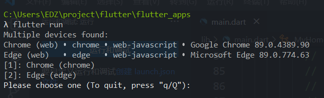

提供的其他热键功能：

```dart
R 键重新启动
r 键热重载(一次性热更新)
q 退出
p 显示网格
P 显示帧率
o 切换 Android 与 iOS 的预览模式
```
