# Flutter 组件学习

## 关于

Flutter 中万物皆组件，所有页面都是组件组成的。

> PS: 如果一个组件不会使用，可以光标移至组件名称，按 `F12`，跳转对应类来查看用法。或者使用 `ctrl+左键` 来触发。

> 还有其他疑问，可以访问[官方文档](https://api.flutter.dev/)，查询用法。

## Hello World

每一门语言都是从 Hello World 开始学起的。

现在[新建一个项目](./flutter-env-setup.md#新建项目-1)，删除 `main.dart` 中的内容，把以下内容复制进入吧。

```dart
import 'package:flutter/material.dart';

void main() => runApp(myApp());

class myApp extends StatelessWidget {
  @override
  Widget build(BuildContext context) {
    return MaterialApp(
      title: 'Hello World',
      home: Scaffold(
        appBar: AppBar(
          title: Text('Welcome to Flutter'),
        ),
        body: Center(
          child: Text('Hello World'),
        ),
      ),
    );
  }
}
```

项目介绍，文件解读：

```dart
import 'package:flutter/material.dart'; // 引入组件样式库

void main() => runApp(MyApp()); // 注册一个 App，引入 MyApp 自定义组件
// 在 Dart 中箭头函数只能执行一行代码，相当于 return 了当前代码块。

/**
 * 创建一个自定义 App 组件，也就是创建一个类
 * Flutter 中调用类可以不使用 new 操作符，下列操作均为有效操作
 * StatelessWidget：无状态组件，所有自定义组件必须继承自 StatelessWidget 或 StatefulWidget，区别后面提到
 */
class MyApp extends StatelessWidget {
  @override
  Widget build(BuildContext context) {  // 子类覆写抽象类方法
    return MaterialApp( // 创建一个 App
      title: 'Hello World', // App 标题
      home: Scaffold( // 创建一个 App 页面
        appBar: AppBar( // App 的 AppBar
          title: Text('Welcome to Flutter'),  // AppBar 标题；Text：文本类型组件
        ),
        body: Center( // App 的 body；Center：居中组件
          child: Text('Hello World'), // body 中的内容
        ),
      ),
    );
  }
}
```

## 阅读注意

以下代码均为包含在 `body` 中使用，不做赘述：

```dart
import 'package:flutter/material.dart';

void main() => runApp(MyApp());

class MyApp extends StatelessWidget {
  @override
  Widget build(BuildContext context) {
    return MaterialApp(
      title: 'Hello World',
      home: Scaffold(
        appBar: AppBar(
          title: Text('Welcome to Flutter'),
        ),
        body: HomeContent(),
      ),
    );
  }
}
```

## Text && Container

`Text` 类似 html 中的 `span` 元素，可以用来包裹文本内容。

`Container` 类似 html 中的 `div` 元素，没有实际的意义但是可以用来包裹使用。

实例：

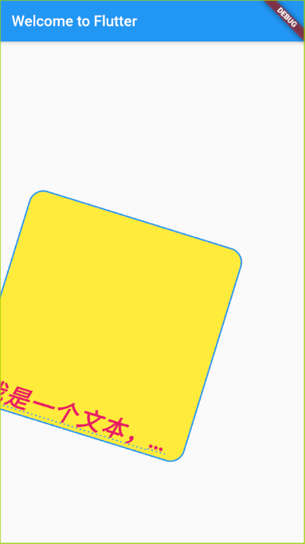

属性介绍：

```dart
class HomeContent extends StatelessWidget {
  @override
  Widget build(BuildContext context) {
    return Center(
      child: Container(
        child: Text(
          '我是一个文本，长度很长很长很长的一个长文本。',
          textAlign:
              TextAlign.left, // 对齐方向(center 居中，left 左对齐，right 右对齐，justfy 两端对齐)
          textDirection: TextDirection.ltr, // 文本方向(ltr 从左至右，rtl 从右至左)
          overflow:
              TextOverflow.ellipsis, // 长度溢出后的处理方式(clip 裁剪，fade 渐隐，ellipsis 省略号)
          maxLines: 1, // 文本显示最大行数
          textScaleFactor: 2, // 字体显示倍率
          style: TextStyle(
            color: Colors.pink, // 字体颜色
            fontSize: 16, // 字体大小
            fontStyle: FontStyle.italic, // 文字样式(italic 斜体，normal 正常体)
            fontWeight: FontWeight.w700, // 字体粗线(bold 粗体，normal 正常体)
            decoration: TextDecoration
                .underline, // 文字装饰线(none 没有线，lineThrough 删除线，overline 上划线，underline下划线)
            decorationColor: Colors.blue, // 文字装饰线颜色
            decorationStyle: TextDecorationStyle
                .dotted, // 文字装饰线风格(dotted 虚线，double 双划线，solid 实线，wavy 波浪线)
            wordSpacing: 2, // 单词间隙(如果是负值，会让单词变得更紧凑）
            letterSpacing: 2, // 字母间隙(如果是负值，会让字母变得更紧凑)
          ), // 字体样式设置
        ), // 包裹内容
        height: 300, // 高度
        width: 300, // 宽度
        decoration: BoxDecoration(
            // 设置颜色，背景，边框
            color: Colors.yellow,
            border: Border.all(color: Colors.blue, width: 2), // 边框样式
            borderRadius: BorderRadius.all(Radius.circular(20))), // 圆角属性
        margin: EdgeInsets.all(30), // 外边距
        padding: EdgeInsets.fromLTRB(10, 30, 5, 0), // 内边距
        transform: Matrix4.rotationZ(0.3), // transform 属性，偏移，位置，倾斜，缩放
        alignment: Alignment.bottomLeft, // 修改元素的显示位置
      ),
    );
  }
}
```

## Image

### 加载远程图片

```dart
class HomeContent extends StatelessWidget {
  @override
  Widget build(BuildContext context) {
    return Center(
      child: Container(
        child: Image.network(
          "https://areschang.top/hero.jpg", // url 地址，只识别 https
          alignment: Alignment.topLeft, // 图片对齐方式
          color: Colors.pink[300], // 指定图片颜色
          colorBlendMode: BlendMode.screen, // 通常配合 color 使用，可以与图片颜色，背景色混合。
          fit: BoxFit.cover, // 图片与容器契合度(fit... 根据父元素宽高来拉伸或挤压，fill 图片会被拉伸充满容器，contain 显示原比例，会有空隙，cover 充满容器但是不会变形，可能会被拉伸，裁切，充满...)
          repeat: ImageRepeat.repeat, // 图片平铺
        ),
        width: 300,
        height: 300,
        decoration: BoxDecoration(color: Colors.yellow),
      ),
    );
  }
}
```

### 加载本地图片

因为 Flutter 程序运行在不同手机屏幕上可以显示不同的分辨率的图片，所以官方规定引入本地图片需要按以下步骤操作：

- 在根目录下新建 `images` 文件夹，普通图片就放在本文件夹下，如果有 `2.0x`,`3.0x` 可以再新建文件夹放在下面

```yaml
- images
  - 2.0x
  - header.png
  - 3.0x
  - header.png
  - header.png
```

> PS: 测试发现不建`2.0x`,`3.0x`文件夹也没有问题，但是推荐写入，可以根据手机显示不同倍数图片。

- 在 `pubspec.yaml` 文件中申明本地图片

```yaml
# The following section is specific to Flutter.
flutter:
  # The following line ensures that the Material Icons font is
  # included with your application, so that you can use the icons in
  # the material Icons class.
  uses-material-design: true
  assets:
    - images/header.png
    - images/2.0x/header.png
    - images/3.0x/header.png
```

文件非常多的话，可以只申明文件夹，自动加载图片名称。

```yaml
# The following section is specific to Flutter.
flutter:
  # The following line ensures that the Material Icons font is
  # included with your application, so that you can use the icons in
  # the material Icons class.
  uses-material-design: true
  assets:
    - images/
    - images/2.0x/
    - images/3.0x/
```

**注意 `yaml` 文件具有严格的文件格式，上下要对齐，不要有空格，否则会报错的。**

- 在代码中使用 `Image.asset` 方法加载本地图片

```dart
class HomeContent extends StatelessWidget {
  @override
  Widget build(BuildContext context) {
    return Center(
      child: Container(
        child: Image.asset('images/header.png'), // 加载本地图片
        width: 300,
        height: 300,
        decoration: BoxDecoration(color: Colors.yellow),
      ),
    );
  }
}
```

其余属性方法和 `Image.network` 是相同的，可以通用。

### 圆角图片

实例：

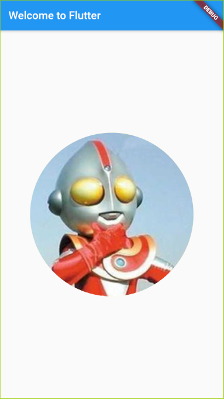

- 方法一：属性圆角

属性圆角不能直接使用 `child` 引入组件使用，需要设定对应的圆角图形，引入图片作为背景使用。

```dart
class HomeContent extends StatelessWidget {
  @override
  Widget build(BuildContext context) {
    return Center(
      child: Container(
        width: 300,
        height: 300,
        decoration: BoxDecoration(
          color: Colors.yellow,
          // borderRadius: BorderRadius.all(Radius.circular(150)),  // 圆角属性，方法一
          borderRadius: BorderRadius.circular(150), // 圆角属性，方法二
          image: DecorationImage(
            image: NetworkImage('https://areschang.top/hero.jpg'), // 圆角图片
          ),
        ),
      ),
    );
  }
}
```

- 方法二：组件圆角

组件圆角可以使用 `ClipOval` 来形成圆角图片，如果图片形状不能直接形成圆形，可以设置 `Image` 组件的宽高实现效果。

```dart
class HomeContent extends StatelessWidget {
  @override
  Widget build(BuildContext context) {
    return Center(
      child: ClipOval(  // 圆角组件
        child: Image.network(
          'https://areschang.top/hero.jpg',
          width: 300,
          height: 300,
        ),
      ),
    );
  }
}
```

## ListView

使用 `ListView` 组件来定义列表，垂直列表可用做新闻列表。

### 垂直列表

实例：

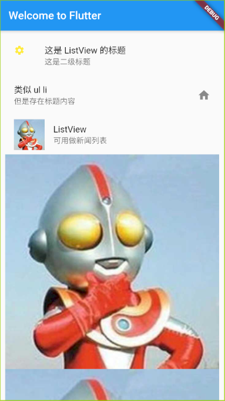

```dart
class HomeContent extends StatelessWidget {
  @override
  Widget build(BuildContext context) {
    return ListView( // 列表组件
      children: [
        ListTile( // 一行列表
          leading: Icon(
            Icons.settings, // 内置图标
            size: 20, // 图标大小
            color: Colors.yellow, // 图标颜色
          ), // 列表前加图标
          title: Text('这是 ListView 的标题'), // 列表标题
          subtitle: Text('这是二级标题'), // 列表二级标题
        ),
        ListTile(
          title: Text('类似 ul li'),
          subtitle: Text('但是存在标题内容'),
          trailing: Icon(Icons.home), // 列表后加图标
        ),
        ListTile(
          leading: Image.network('https://areschang.top/hero.jpg'), // 加载图片当做图标
          title: Text('ListView '),
          subtitle: Text('可用做新闻列表'),
        ),
        Image.network(
            'https://areschang.top/hero.jpg'), // 这可以放置所有组件，不是只能放置 ListView
        Image.network('https://areschang.top/hero.jpg'),
        Image.network('https://areschang.top/hero.jpg'),
      ],
      padding: EdgeInsets.all(10), // padding 内边距属性
      scrollDirection:
          Axis.horizontal, // 列表方向 (horizontal 水平列表，vertical 垂直列表)，默认为垂直列表
    );
  }
}
```

### 水平列表

可以通过 `scrollDirection` 属性来定义列表是水平还是垂直展示，默认为垂直方向展示。

实例：

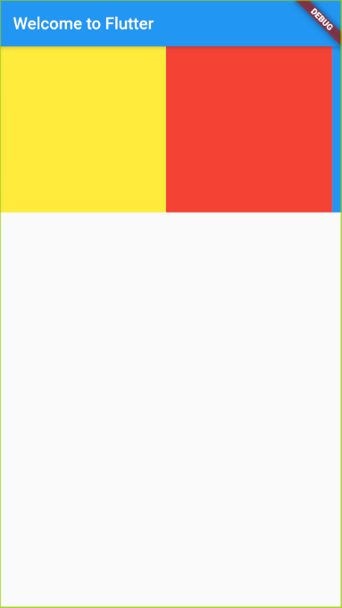

```dart
class HomeContent extends StatelessWidget {
  @override
  Widget build(BuildContext context) {
    return Container(
      height: 200,  // 限制 ListView 高度
      child: ListView(
        children: [
          Container(
            width: 200,
            height: 200,
            color: Colors.yellow,
          ),
          Container(
            width: 200,
            height: 200,
            color: Colors.red,
          ),
          Container(
            width: 200,
            height: 200,
            color: Colors.blue,
          ),
          Container(
            width: 200,
            height: 200,
            color: Colors.green,
          ),
        ],
        scrollDirection:
            Axis.horizontal, // 列表方向 (horizontal 水平列表，vertical 垂直列表)，默认为垂直列表
      ),
    );
  }
}
```

**`ListView` 设置为垂直列表内部容器设置宽度无作用，设置为水平列表内部容器设置高度无作用。**

### 动态列表

动态列表，可以理解为接口动态获取数据，然后加载。总共两种方法，可以使用。

因无接口，以下为循环模拟数据。

#### 循环加载

```dart
class HomeContent extends StatelessWidget {
  List<Widget> _getDate() { // 私有方法，模拟获取数据
    List<Widget> list = new List(); // 定义空数组，添加数据
    for (var i = 0; i < 20; i++) {
      list.add(ListTile(
        title: Text('我是第$i组件'),
      ));
    }
    return list;
  }

  @override
  Widget build(BuildContext context) {
    return ListView(
      children: this._getDate(),  // 动态获取数据
    );
  }
}
```

#### ListView.builder

```dart
class HomeContent extends StatelessWidget {
  List list = new List();
  HomeContent() {
    for (var i = 0; i < 20; i++) {  // 循环模拟数据加载
      this.list.add('我是第$i条数据');
    }
  }
  @override
  Widget build(BuildContext context) {
    return ListView.builder(  // 生成列表
      itemCount: this.list.length,  // 列表计数
      itemBuilder: (context, index) { // 列表生成加载
        return ListTile(
          title: Text(this.list[index]),
        );
      },
    );
  }
}
```

## GridView

`GridView` 网格布局，可以控制具体行列及内容展示。

`GridView` 和 `ListView` 相同，也有两种使用方法，但是 `GridView` 无法直接使用 `()` 传入组件使用，需要使用 `.count` 方法来实现。

### GridView.count

实例：

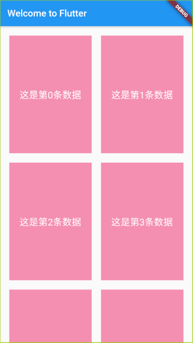

```dart
class HomeContent extends StatelessWidget {
  List<Widget> _getDataList() {
    // 模拟数据
    List<Widget> list = new List();
    for (var i = 0; i < 20; i++) {
      list.add(Container(
        alignment: Alignment.center,
        child: Text(
          '这是第$i条数据',
          style: TextStyle(color: Colors.white, fontSize: 20),
        ),
        color: Colors.pink[200],
      ));
    }
    return list;
  }

  @override
  Widget build(BuildContext context) {
    return GridView.count(
      crossAxisCount: 2, // 控制列表总共几列
      crossAxisSpacing: 20, // 控制列表左右之间距离
      mainAxisSpacing: 20, // 控制列表上下之间距离
      padding: EdgeInsets.all(20), // 控制列表与App主页面之间距离（与父容器）
      childAspectRatio:
          0.7, // 控制列表宽度和高度的比例，列表中无法直接设置 height，只能通过 childAspectRatio 来设置。
      children: this._getDataList(), // 模拟数据
    );
  }
}
```

### GridView.builder

`GridView.builder` 方法循环出来的内容需要在 `gridDelegate` 属性中修改列表样式信息。

`gridDelegate` 的属性类型名有点长：

- `SliverGridDelegateWithFixedCrossAxisCount`
- `SliverGridDelegateWithMaxCrossAxisExtent`

```dart
class HomeContent extends StatelessWidget {
  List list = new List();
  HomeContent() {
    for (var i = 0; i < 20; i++) {
      // 循环模拟数据加载
      this.list.add('我是第$i条数据');
    }
  }
  @override
  Widget build(BuildContext context) {
    return GridView.builder(
      shrinkWrap: true,
      itemCount: this.list.length,
      itemBuilder: (context, index) {
        return Text(this.list[index]);
      },
      gridDelegate: SliverGridDelegateWithFixedCrossAxisCount(
        // 列表数据样式要放在这里修改
        crossAxisCount: 2, // 控制列表总共几列，这是填项
        mainAxisSpacing: 10, // 控制列表上下之间距离
        crossAxisSpacing: 10, // 控制列表左右之间距离
        childAspectRatio: 0.7, // 控制列表宽度和高度的比例
      ),
    );
  }
}
```

### Padding

Flutter 中有些组件是没有 `padding` 属性的，所以提供了一个 `Padding` 组件，可以用于包裹展示。

实例：(`Image` 组件不能设置 `padding` 属性)

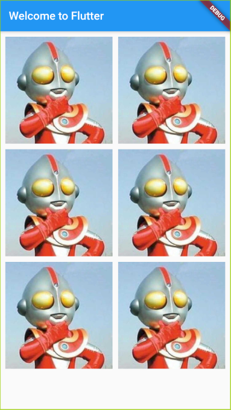

```dart
class HomeContent extends StatelessWidget {
  @override
  Widget build(BuildContext context) {
    return GridView.count(
      padding: EdgeInsets.fromLTRB(0, 0, 10, 10),
      crossAxisCount: 2,
      children: [
        Padding(  // Padding 组件，主要用途就是包裹没有 padding 属性的组件实现边距效果
          padding: EdgeInsets.fromLTRB(10, 10, 0, 0),
          child: Image.network('https://areschang.top/hero.jpg'),
        ),
        Padding(
          padding: EdgeInsets.fromLTRB(10, 10, 0, 0),
          child: Image.network('https://areschang.top/hero.jpg'),
        ),
        Padding(
          padding: EdgeInsets.fromLTRB(10, 10, 0, 0),
          child: Image.network('https://areschang.top/hero.jpg'),
        ),
        Padding(
          padding: EdgeInsets.fromLTRB(10, 10, 0, 0),
          child: Image.network('https://areschang.top/hero.jpg'),
        ),
      ],
    );
  }
}
```

## 布局组件

以下三个组件展示需要共用一个自定义组件，请先引入。

```dart
// ignore: must_be_immutable
class IconContainer extends StatelessWidget { // 组件化 Icon 块
  double size;
  Color color;
  var icon;
  IconContainer(this.icon, {this.color = Colors.red, this.size = 32.0});  // 设置可选参数及默认值
  @override
  Widget build(BuildContext context) {
    return Container(
      width: 100.0,
      height: 100.0,
      color: this.color,
      child: Center(
        child: Icon(
          this.icon,
          size: this.size,
          color: Colors.white,
        ),
      ),
    );
  }
}
```

### Row

水平布局组件，可以通过设置 X 轴、Y 轴来进行页面布局。

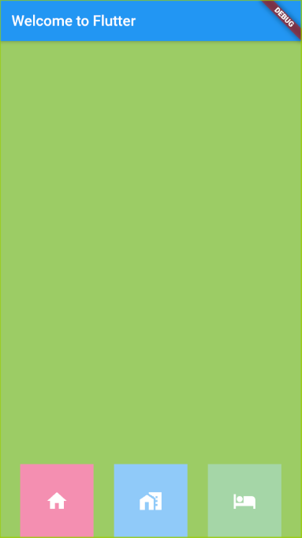

```dart
class HomeContent extends StatelessWidget {
  @override
  Widget build(BuildContext context) {
    return Container(
      height: 800.0,  // 父容器设有高度 crossAxisAlignment 才能展示出效果
      color: Colors.lightGreen[400],
      child: Row( // 水平布局
        mainAxisAlignment: MainAxisAlignment.spaceEvenly, // 主轴方向排序方法
        crossAxisAlignment: CrossAxisAlignment.end, // 次轴方向排序方法
        children: [
          IconContainer(  // 调用生成 Icon 块
            Icons.home,
            color: Colors.pink[200],
          ),
          IconContainer(
            Icons.home_work,
            color: Colors.blue[200],
          ),
          IconContainer(
            Icons.hotel,
            color: Colors.green[200],
          ),
        ],
      ),
    );
  }
}
```

### Column

垂直布局组件，`Column` 组件和 `Row` 之间的不同在于，主轴和次轴的方向是相反的，使用时请注意。

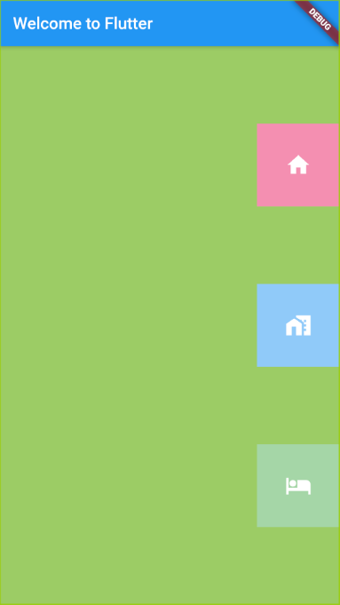

```dart
class HomeContent extends StatelessWidget {
  @override
  Widget build(BuildContext context) {
    return Container(
      width: 800.0,  // 父容器设有宽度 mainAxisAlignment 才能展示出效果
      color: Colors.lightGreen[400],
      child: Column( // 垂直布局
        mainAxisAlignment: MainAxisAlignment.spaceEvenly, // 主轴方向排序方法
        crossAxisAlignment: CrossAxisAlignment.end, // 次轴方向排序方法
        children: [
          IconContainer(  // 调用生成 Icon 块
            Icons.home,
            color: Colors.pink[200],
          ),
          IconContainer(
            Icons.home_work,
            color: Colors.blue[200],
          ),
          IconContainer(
            Icons.hotel,
            color: Colors.green[200],
          ),
        ],
      ),
    );
  }
}
```

### Expanded

类似 `flex布局`，可以自动适配占据大小。

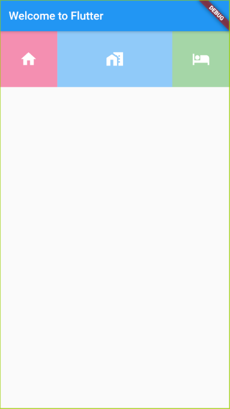

```dart
class HomeContent extends StatelessWidget {
  @override
  Widget build(BuildContext context) {
    return Row(
      children: [
        Expanded( // 嵌套组件
          flex: 1,  // 占据份额
          child: IconContainer( // 调用生成 Icon 块
            Icons.home,
            color: Colors.pink[200],
          ),
        ),
        Expanded(
          flex: 2,
          child: IconContainer(
            Icons.home_work,
            color: Colors.blue[200],
          ),
        ),
        Expanded(
          flex: 1,
          child: IconContainer(
            Icons.hotel,
            color: Colors.green[200],
          ),
        ),
      ],
    );
  }
}
```

### 布局 Demo

实现下例布局：

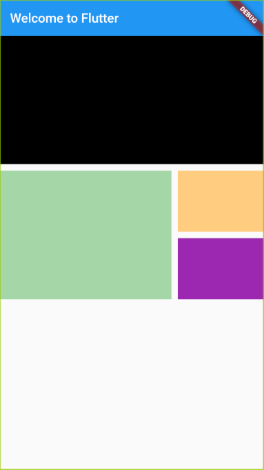

布局实例：

```dart
class HomeContent extends StatelessWidget {
  @override
  Widget build(BuildContext context) {
    return Column(
      children: [
        Row(
          children: [
            Expanded(
              flex: 1,
              child: Container(
                height: 200,
                color: Colors.black,
                child: Text(''),
              ),
            )
          ],
        ),
        SizedBox( // 撑开空白，也可以使用 margin
          height: 10,
        ),
        Row(
          children: [
            Expanded(
              flex: 2,
              child: Container(
                height: 200,
                color: Colors.green[200],
                child: Text(''),
              ),
            ),
            SizedBox(width: 10),
            Expanded(
              flex: 1,
              child: Column(
                children: [
                  Row(
                    children: [
                      Expanded(
                        flex: 1,
                        child: Container(
                          height: 95,
                          color: Colors.orange[200],
                          child: Text(''),
                        ),
                      )
                    ],
                  ),
                  SizedBox(
                    height: 10,
                  ),
                  Row(
                    children: [
                      Expanded(
                        flex: 1,
                        child: Container(
                          height: 95,
                          color: Colors.purple,
                          child: Text(''),
                        ),
                      )
                    ],
                  ),
                ],
              ),
            ),
          ],
        )
      ],
    );
  }
}
```

## 定位组件

定位组件，又名层叠组件，可以使组件脱标，定位到父容器某一处。

可以通过 [Stack](#stack)、[Align](#align)、[Positioned](#positioned) 组件实现。

### Stack

`Stack` 组件可以包裹需要定位的组件，可以通过 `alignment` 属性来控制内容位置。

`alignment` 内置了一些方位，如果需要自定义可以通过 `Alignment(0, 0)` 来控制。

数值取舍值范围在 -1 到 1 之间，可以理解为左上角到右下角范围为 -1 到 1 之间。

实例：

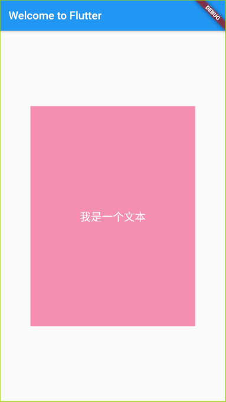

```dart
class HomeContent extends StatelessWidget {
  @override
  Widget build(BuildContext context) {
    return Center(
      child: Stack( // 定位组件
        alignment: Alignment.center,  // 内容定位，也可以用数字控制，Alignment(0, 0) 数值为 -1 到 1 之间
        children: [
          Container(
            width: 300,
            height: 400,
            color: Colors.pink[200],
          ),
          Text(
            '我是一个文本',
            style: TextStyle(fontSize: 20, color: Colors.white),
          )
        ],
      ),
    );
  }
}
```

但是 `Stack` 只适合用于内部只有一个组件时定位，如果多个组件会重叠到一起。这时可以结合 [Align](#align) 和 [Positioned](#positioned) 使用。

### Align

可以嵌套需要定位的元素，单独给予定位数值。

实例：

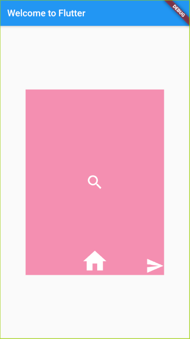

```dart
class HomeContent extends StatelessWidget {
  @override
  Widget build(BuildContext context) {
    return Center(
      child: Container(
        width: 300,
        height: 400,
        color: Colors.pink[200],
        child: Stack(
          children: [
            Align(  // 嵌套定位组件
              alignment: Alignment(0, 1), // 定位属性
              child: Icon(
                Icons.home,
                size: 60,
                color: Colors.white,
              ),
            ),
            Align(
              alignment: Alignment.center,
              child: Icon(
                Icons.search,
                size: 40,
                color: Colors.white,
              ),
            ),
            Align(
              alignment: Alignment(1, 1),
              child: Icon(
                Icons.send,
                size: 40,
                color: Colors.white,
              ),
            ),
          ],
        ),
      ),
    );
  }
}
```

### Positioned

`Positioned` 组件和 `CSS` 中的定位一样，是由 `top`、`right`、`bottom`、`left` 属性来控制方位的。

实例：

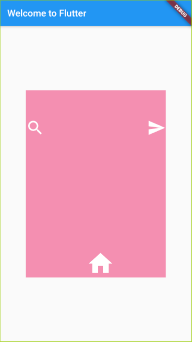

```dart
class HomeContent extends StatelessWidget {
  @override
  Widget build(BuildContext context) {
    return Center(
      child: Container(
        width: 300,
        height: 400,
        color: Colors.pink[200],
        child: Stack(
          children: [
            Positioned( // 嵌套定位组件
              bottom: 0,  // 定位属性，double 类型
              left: 130,  // 定位属性，double 类型
              child: Icon(
                Icons.home,
                size: 60,
                color: Colors.white,
              ),
            ),
            Positioned(
              top: 60,
              child: Icon(
                Icons.search,
                size: 40,
                color: Colors.white,
              ),
            ),
            Positioned(
              top: 60,
              right: 0,
              child: Icon(
                Icons.send,
                size: 40,
                color: Colors.white,
              ),
            ),
          ],
        ),
      ),
    );
  }
}
```

## AspectRatio

`AspectRatio` 组件的作用是相对父元素可以调整子元素的宽高比

```dart
class HomeContent extends StatelessWidget {
  @override
  Widget build(BuildContext context) {
    return Container(
      width: 300,
      child: AspectRatio(
        aspectRatio: 2.0/1.0, // 相对父元素设置宽高比
        child: Container(
          color: Colors.red,
        ),
      ),
    );
  }
}
```

## Card

`Card` 可以理解为是封装好的卡片组件，可以直接调用展示。

以下实例为文字卡片，图文卡片可以在 [CircleAvatar](#circleavatar) 组件中查看。

实例：

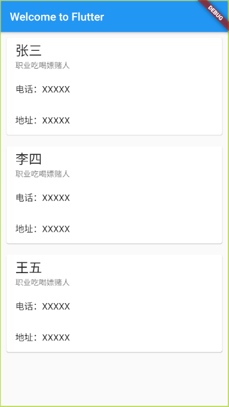

```dart
class HomeContent extends StatelessWidget {
  @override
  Widget build(BuildContext context) {
    return ListView(
      children: [
        Card( // 卡片组件
          margin: EdgeInsets.all(10),
          child: Column(
            children: [
              ListTile(
                title: Text(
                  '张三',
                  style: TextStyle(fontSize: 24),
                ),
                subtitle: Text('职业吃喝嫖赌人'),
              ),
              ListTile(
                title: Text('电话：XXXXX'),
              ),
              ListTile(
                title: Text('地址：XXXXX'),
              ),
            ],
          ),
        ),
        Card(
          margin: EdgeInsets.all(10),
          child: Column(
            children: [
              ListTile(
                title: Text(
                  '李四',
                  style: TextStyle(fontSize: 24),
                ),
                subtitle: Text('职业吃喝嫖赌人'),
              ),
              ListTile(
                title: Text('电话：XXXXX'),
              ),
              ListTile(
                title: Text('地址：XXXXX'),
              ),
            ],
          ),
        ),
        Card(
          margin: EdgeInsets.all(10),
          child: Column(
            children: [
              ListTile(
                title: Text(
                  '王五',
                  style: TextStyle(fontSize: 24),
                ),
                subtitle: Text('职业吃喝嫖赌人'),
              ),
              ListTile(
                title: Text('电话：XXXXX'),
              ),
              ListTile(
                title: Text('地址：XXXXX'),
              ),
            ],
          ),
        ),
      ],
    );
  }
}
```

## CircleAvatar

设置头像专用组件，可以直接生成圆形头像。

> PS: 以下实例包含图文卡片展示。

实例：

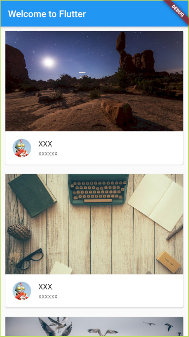

```dart
class HomeContent extends StatelessWidget {
  @override
  Widget build(BuildContext context) {
    return ListView(
      children: [
        Card(
          margin: EdgeInsets.all(10),
          child: Column(
            children: [
              AspectRatio(  // 设置图片纵横比
                aspectRatio: 16 / 9,
                child: Image.network(
                  'https://picsum.photos/id/884/3300/2202',
                  fit: BoxFit.cover,
                ),
              ),
              ListTile(
                leading: CircleAvatar(  // 设置头像专用组件，可以直接变为圆形头像
                  backgroundImage:
                      NetworkImage('https://areschang.top/hero.jpg'),
                ),
                title: Text('XXX'),
                subtitle: Text('xxxxxx'),
              )
            ],
          ),
        ),
        Card(
          margin: EdgeInsets.all(10),
          child: Column(
            children: [
              AspectRatio(  // 设置图片纵横比
                aspectRatio: 16 / 9,
                child: Image.network(
                  'https://picsum.photos/id/885/4000/2667',
                  fit: BoxFit.cover,
                ),
              ),
              ListTile(
                leading: CircleAvatar(  // 设置头像专用组件，可以直接变为圆形头像
                  backgroundImage:
                      NetworkImage('https://areschang.top/hero.jpg'),
                ),
                title: Text('XXX'),
                subtitle: Text('xxxxxx'),
              )
            ],
          ),
        ),
      ],
    );
  }
}
```

## Wrap && RaisedButton

`Wrap` 可以实现类似流布局，宽度不足以容下内容，会自动换行。

`RaisedButton` 组件可以用来自定义按钮功能。

::: danger 注意：
RaisedButton 在 v1.25.0-8.1 之后被弃用，可以使用 ElevatedButton 代替使用
:::

实例：

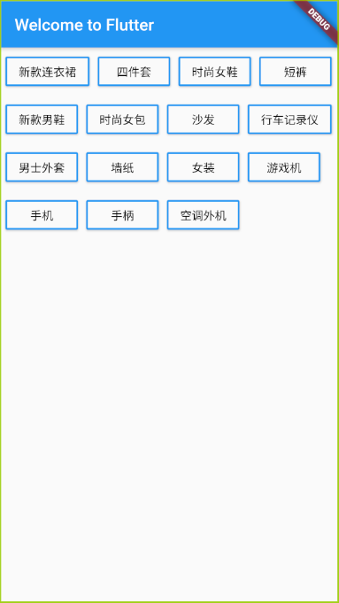

```dart
// 自定义按钮组件
class MyButton extends StatelessWidget {
  final String text;
  const MyButton(this.text, {Key key}) : super(key: key);
  @override
  Widget build(BuildContext context) {
    return RaisedButton(
      // 按钮组件
      child: Text(text),
      // textColor:
      //     Theme.of(context).accentColor, // 设置文字颜色，跟随主题颜色,需要搭配 onPressed 使用
      color: Color(0xfffafafa),
      textColor: Colors.black, // 设置文字颜色
      onPressed: () {}, // 监听事件
      shape: RoundedRectangleBorder(
        borderRadius: BorderRadius.circular(2), // 设置圆角
        side: BorderSide(width: 2, color: Colors.blue[500]), // 设置边框
      ),
    );
  }
}

class HomeContent extends StatelessWidget {
  @override
  Widget build(BuildContext context) {
    return Container(
      padding: EdgeInsets.all(5),
      child: Wrap( // 流式布局
        direction: Axis.horizontal, // 改变主轴方向
        spacing: 10, // 改变主轴之间距离
        runSpacing: 10, // 改变Y轴之间距离
        alignment: WrapAlignment.start, // 主轴内容对齐方式
        runAlignment: WrapAlignment.start, // Y轴内容对齐方式
        children: [
          MyButton('新款连衣裙'),
          MyButton('四件套'),
          MyButton('时尚女鞋'),
          MyButton('短裤'),
          MyButton('新款男鞋'),
          MyButton('时尚女包'),
          MyButton('沙发'),
          MyButton('行车记录仪'),
          MyButton('男士外套'),
          MyButton('墙纸'),
          MyButton('女装'),
          MyButton('游戏机'),
          MyButton('手机'),
          MyButton('手柄'),
          MyButton('空调外机'),
        ],
      ),
    );
  }
}
```

Flutter 中可以通过 `FloatingActionButton` 组件直接生成一个浮动在右下角按钮，可以应用多种场景。具体使用可以参考 [路由跳转](#路由跳转) Demo 实例。

## 有状态组件

`StatefulWidget` 是有状态组件的意思，使用方法同无状态组件相同。

区别在于，无状态组件无法更新组件内的展示变量，有状态组件可以通过 `setState` 方法更新变量。

### 实例

实现点击按钮改变变量

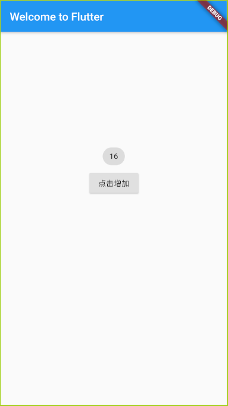

```dart
class HomeContent extends StatefulWidget {
  HomeContent({Key key}) : super(key: key);

  @override
  _HomeContentState createState() => _HomeContentState();
}

class _HomeContentState extends State<HomeContent> {
  int countNum = 0;
  @override
  Widget build(BuildContext context) {
    return Center(
      child: Column(
        children: [
          SizedBox(
            height: 200,
          ),
          Chip(
            label: Text('$countNum'),
          ),
          RaisedButton(
            child: Text('点击增加'),
            onPressed: () { // 监听点击事件
              setState(() { // 更新变量事件，只有在状态组件中在这个方法。
                this.countNum++;
              });
            },
          ),
        ],
      ),
    );
  }
}
```

::: tip VS Code 插件安利

- Awesome Flutter Snippets 可以通过简写来快速插入模板信息。

常用代码块：

- `statelessW` 快速生成无状态组件
- `statefulW` 快速生成有状态组件
  :::

### Demo 练习

点击添加一条信息渲染。

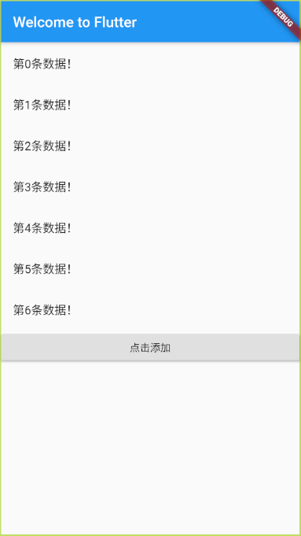

```dart
class HomeContent extends StatefulWidget {
  HomeContent({Key key}) : super(key: key);

  @override
  _HomeContentState createState() => _HomeContentState();
}

class _HomeContentState extends State<HomeContent> {
  List list = new List();
  @override
  Widget build(BuildContext context) {
    return Container(
      child: ListView(
        children: [
          Column(
            children: this.list.map((item) {
              return ListTile(
                title: Text(item),
              );
            }).toList(),
          ),
          RaisedButton(
            child: Text('点击添加'),
            onPressed: () {
              setState(() {
                this.list.add('第${this.list.length}条数据！');
              });
            },
          )
        ],
      ),
    );
  }
}
```

## BottomNavigationBar

通过 `BottomNavigationBar` 组件设置底部菜单栏，菜单栏最少定义两个，否则会报错。

> PS: 本实例是新建了一个 `MyApp` 组件，复制查看时请注释之前注册的 Flutter 应用。

实例：

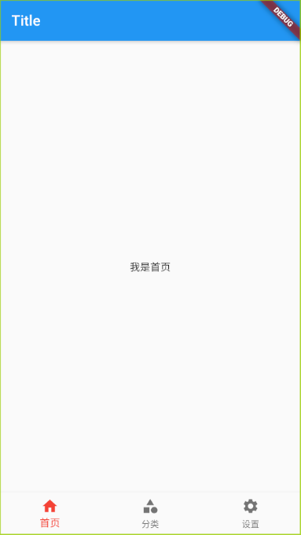

```dart
class MyApp extends StatelessWidget {
  const MyApp({Key key}) : super(key: key);

  @override
  Widget build(BuildContext context) {
    return MaterialApp(
      title: 'Hello World',
      home: HomeContent(),
    );
  }
}

class HomeContent extends StatefulWidget {
  HomeContent({Key key}) : super(key: key);

  @override
  _HomeContentState createState() => _HomeContentState();
}

class _HomeContentState extends State<HomeContent> {
  int _currentIndex = 0;
  List _pageList = [  // 页面展示，也可以包含组件内容
    Text('我是首页'),
    Text('我是分类页'),
    Text('我是设置页'),
  ];
  @override
  Widget build(BuildContext context) {
    return Scaffold(
      appBar: AppBar(
        title: Text('Title'),
      ),
      body: Center(
        child: this._pageList[this._currentIndex],  // 跟据选中菜单设置页面展示
      ),
      bottomNavigationBar: BottomNavigationBar(  // 设置菜单组件
        iconSize: 24, // 设置 icon 图标大小
        fixedColor: Colors.red, // 选中图标高亮颜色
        currentIndex: this._currentIndex, // 默认选中 ItemBar 高亮
        onTap: (int index) {  // 监听点击事件
          setState(() { // 动态设置 ItemBar 高亮及页面展示
            this._currentIndex = index;
          });
        },
        type: BottomNavigationBarType.fixed,  // 如果图标超过3个，有可能会被挤压变形，可以设置 type 属性改变显示方式
        items: [  // items 最少要有两个，否则会报错。
          BottomNavigationBarItem(  // 设置 ItemBar 内容
            label: '首页',  // 文字提示
            icon: Icon(Icons.home), // 图标展示
          ),
          BottomNavigationBarItem(
            label: '分类',
            icon: Icon(Icons.category),
          ),
          BottomNavigationBarItem(
            label: '设置',
            icon: Icon(Icons.settings),
          ),
        ],
      ),
    );
  }
}
```

## 路由跳转

在 Flutter 中可以使用 `Navigator` 来进行路由跳转传参。

`Navigator` 又有 [普通路由](#普通路由) 和 [命名路由](#命名路由) 之分。

### 普通路由

在小型项目中可能没有路由配置文件的必要性，也可以直接引入文件来进行页面跳转和传参。

实例：

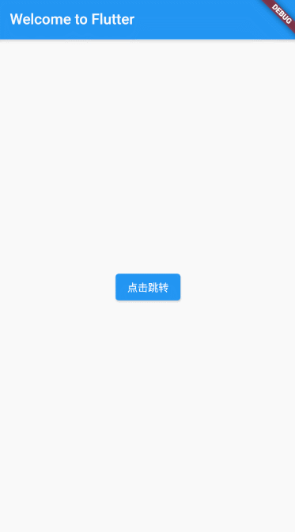

- 把以下代码写入 `main.dart` 文件中

```dart {2,30-35}
import 'package:flutter/material.dart'; // 引入组件样式库
import './pages/NavigatorPage.dart'; // 引入自定义组件

void main() => runApp(MyApp());

class MyApp extends StatelessWidget {
  @override
  Widget build(BuildContext context) {
     return MaterialApp(
      title: 'Hello World',
      home: Scaffold(
        appBar: AppBar(
          title: Text('Welcome to Flutter'),
        ),
        body: HomeContent(),
      ),
    );
  }
}

class HomeContent extends StatelessWidget {
  const HomeContent({Key key}) : super(key: key);

  @override
  Widget build(BuildContext context) {
    return Center(
      child: ElevatedButton( // RaisedButton 在 v1.25.0-8.1 之后被弃用，可以使用 ElevatedButton 代替使用
        child: Text('点击跳转'),
        onPressed: () {
          Navigator.of(context).push( // 路由跳转
            MaterialPageRoute(
              builder: (context) =>
                  NavigatorPage('子页面', pageName: 'Page'), // 跳转页面组件引用及传参
            ),
          );
        },
      ),
    );
  }
}
```

> 普通路由传参可以直接跟在跳转方法后面。

- 新建一个子页面文件，在 `pages -> NavigatorPage.dart` 中写入以下代码：

```dart {23}
import 'package:flutter/material.dart';

class NavigatorPage extends StatelessWidget {
  String pageName; // 页面名称
  String tier; // 层级
  NavigatorPage(this.tier, {this.pageName = "二级"}); // 接受父页面传参并在为空的情况下设置默认值

  @override
  Widget build(BuildContext context) {
    /**
     * 因为这里是一个页面，不单单是个组件，所以必须要使用 Scaffold 包裹，否则会没有页面样式
     */
    return Scaffold(
      appBar: AppBar(
        title: Text('Navigator Page 页面'),
      ),
      body: Center(
        child: Text('我是 $pageName $tier'),
      ),
      floatingActionButton: FloatingActionButton(
        // 右下角生成一个浮动 button
        onPressed: () {
          Navigator.of(context).pop();  // 回到上一个页面
        },
        child: Text('返回'),
      ),
    );
  }
}
```

> PS: 子页面左上角返回按钮是自动生成的，根据 Android 和 IOS 系统的不同，程现效果会有不同。

### 命名路由

命名路由，需要在 `MaterialApp` 组件中使用 `routers` 属性注册路由，然后使用 `pushNamed` 方法进行路由跳转。

当然，路由文件多了也是非常头痛的，也可以抽离成单独路由文件引入。

#### 在 `main.dart` 中配置命名路由并使用

```dart {2,17-20,34-35}
import 'package:flutter/material.dart'; // 引入组件样式库
import './pages/NavigatorPage.dart'; // 引入自定义组件

void main() => runApp(MyApp());

class MyApp extends StatelessWidget {
  @override
  Widget build(BuildContext context) {
     return MaterialApp(
      title: 'Hello World',
      home: Scaffold(
        appBar: AppBar(
          title: Text('Welcome to Flutter'),
        ),
        body: HomeContent(),
      ),
      routers: {  // 注册路由组件，也可以抽离为路由文件
        '/NavigatorPage': (context) => NavigatorPage(),
        // ... 省略其它路由注册信息
      },
    );
  }
}

class HomeContent extends StatelessWidget {
  const HomeContent({Key key}) : super(key: key);

  @override
  Widget build(BuildContext context) {
    return Center(
      child: ElevatedButton( // RaisedButton 在 v1.25.0-8.1 之后被弃用，可以使用 ElevatedButton 代替使用
        child: Text('点击跳转'),
        onPressed: () {
          Navigator.pushNamed(context, '/NavigatorPage'); // 命名路由跳转，方法一
          // Navigator.of(context).pushNamed('/NavigatorPage'); // 命名路由跳转，方法二
        },
      ),
    );
  }
}
```

#### 命名路由传参

在 Flutter 最初的版本中，命名路由是不能传参的，后来才支持了传递参数。

现在我们可以通过 `onGenerateRoute` 函数来提取参数，然后把参数传递给组件。

下面演示操作方法：

1. 创建跳转子页面并引入

```dart
import 'package:flutter/material.dart';

class SearchPage extends StatelessWidget {
  final Map arguments;  // 创建参数
  const SearchPage({this.arguments}); // 接取参数

  @override
  Widget build(BuildContext context) {
    return Scaffold(  // 创建页面
      appBar: AppBar(
        title: Text('搜索页面'),
      ),
      body: Text('搜索页面内容区域${arguments != null ? arguments['id'] : '0'}'),
    );
  }
}
```

2. 修改 `main.dart` ,使用 `onGenerateRoute` 函数代替 `router`

> 下方附带一种 `router` 传参方法

```dart {7-9,21-41}
import 'package:flutter/material.dart';
import 'pages/Search.dart';

void main() => runApp(MyApp());

class MyApp extends StatelessWidget {
  final routes = {  // 注册路由表，可抽离
    '/Search': (context, {arguments}) => SearchPage(arguments: arguments),
  };

  @override
  Widget build(BuildContext context) {
    return MaterialApp(
      title: 'Hello World',
      home: Scaffold(
        appBar: AppBar(
          title: Text('Welcome to Flutter'),
        ),
        body: HomeContent(),
      ),
      onGenerateRoute: (RouteSettings settings) {
        // 统一处理 关键代码
        final String name = settings.name;
        final Function pageContentBuilder = routes[name];
        if (pageContentBuilder != null) {
          if (settings.arguments != null) {
            final Route route = MaterialPageRoute(
                builder: (context) => pageContentBuilder(context,
                    arguments: settings.arguments));
            return route;
          } else {
            final Route route = MaterialPageRoute(
                builder: (context) => pageContentBuilder(context));
            return route;
          }
        }
      }
      // routes: {  // 单独路由传参，和 onGenerateRoute 不能共存
      //   '/Search': (context, {arguments}) =>
      //       SearchPage(arguments: ModalRoute.of(context).settings.arguments)
      // },
    );
  }
}
```

3. 使用命名路由跳转传参

```dart
class HomeContent extends StatelessWidget {
  const HomeContent({Key key}) : super(key: key);

  @override
  Widget build(BuildContext context) {
    return Center(
      child: ElevatedButton(
        child: Text('命名路由传参'),
        onPressed: () {
          Navigator.pushNamed(context, '/Search', arguments: {'id': 123});
        },
      ),
    );
  }
}
```

> 以上方法都可抽离，可参考项目复杂程度及个人意愿。

### 路由抽离 && 设置默认入口

项目大了之后，组件变多，路由文件难以维护。

我们可以抽离路由代码为单独一个文件，以便维护。

组件抽离之后，`main.dart` 中可以使用 `initialRoute` 来设置默认进入路由。

模块化步骤：

1. 抽离路由代码为单独一个文件：

在 `lib` 文件夹下新建一个 `router` 文件夹，里面新建一个 `index.dart` 文件。

```dart {1-27}
import 'package:flutter/material.dart';
import '../pages/Search.dart';  // 引入组件
import '../pages/index.dart'; // 引入组件

final routes = {
  '/': (context) => IndexPage(), // 注册无参数路由
  '/Search': (context, {arguments}) =>
      SearchPage(arguments: arguments), // 注册有参数路
};

var onGenerateRoute = (RouteSettings settings) {
  // 统一处理 关键代码
  final String name = settings.name;
  final Function pageContentBuilder = routes[name];
  if (pageContentBuilder != null) {
    if (settings.arguments != null) {
      final Route route = MaterialPageRoute(
          builder: (context) =>
              pageContentBuilder(context, arguments: settings.arguments));
      return route;
    } else {
      final Route route =
          MaterialPageRoute(builder: (context) => pageContentBuilder(context));
      return route;
    }
  }
};
```

2. 在 `main.dart` 中使用路由文件注册的内容并设置初始路由。

```dart {2,11-12}
import 'package:flutter/material.dart';
import 'router/index.dart'; // 引入路由文件

void main() => runApp(MyApp());

class MyApp extends StatelessWidget {
  @override
  Widget build(BuildContext context) {
    return MaterialApp(
      title: 'Hello World',
      initialRoute: '/',  // 设置默认初始路由
      onGenerateRoute: onGenerateRoute, // 使用路由文件中注册的函数
    );
  }
}
```

3. 组件中使用路由跳转。

```dart {15}
import 'package:flutter/material.dart';

class IndexPage extends StatelessWidget {
  @override
  Widget build(BuildContext context) {
    return Container(
      child: Scaffold(
        appBar: AppBar(
          title: Text('Welcome to Flutter'),
        ),
        body: Center(
          child: ElevatedButton(
            child: Text('命名路由传参'),
            onPressed: () {
              Navigator.pushNamed(context, '/Search', arguments: {'id': 123});  // 路由跳转
            },
          ),
        ),
      ),
    );
  }
}
```

### 返回上一层路由

可以理解为返回上一页，调用 `Navigator.of(context).pop()` 来跳转回上一层路由。

> PS: 或者写为 `Navigator.pop(context)` 也可以。
>
> 注意，如果要使用 `pop()` 返回上一级，必须有上级页面存在！

实例：

```dart {12-14}
import 'package:flutter/material.dart';

class SearchContent extends StatelessWidget {
  @override
  Widget build(BuildContext context) {
    return Scaffold(
      appBar: AppBar(
        title: Text('搜索内容'),
      ),
      body: Center(
        child: ElevatedButton(
          onPressed: () => {
            Navigator.pop(context)  // 返回上一层路由
          },
          child: Text('点击返回上一页'),
        ),
      ),
    );
  }
}
```

> 本例同下一回 [替换路由](#替换路由) 一起测试。

### 替换路由

替换路由可以简单理解为：

销毁当前页面，生成要跳转的页面。

这时如果使用 `pop()` 返回上一个页面的话就不会返回到已销毁的页面。

实例：

```dart {13}
import 'package:flutter/material.dart';

class SearchPage extends StatelessWidget {
  @override
  Widget build(BuildContext context) {
    return Scaffold(
      appBar: AppBar(
        title: Text('搜索页面'),
      ),
      body: Center(
          child: ElevatedButton(
        onPressed: () => {
          Navigator.pushReplacementNamed(context, '/search_content') // 路由替换
        },
        child: Text('点击搜索'),
      )),
    );
  }
}
```

> PS：注意，本页面由于跳转过程会销毁，不要放在第一页。
