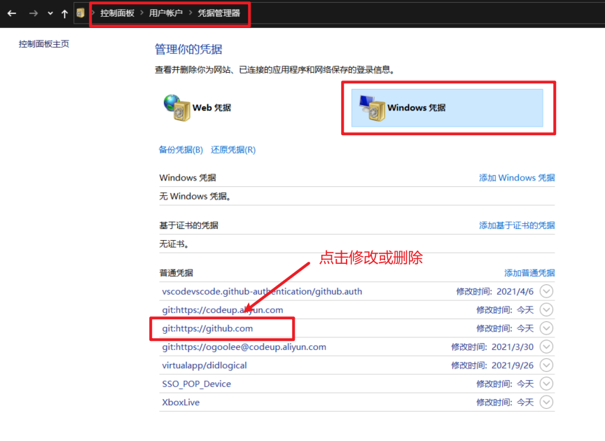

# '保存 git 帐户密码'

## 写入 Git 凭证

如果你使用的是 SSH 方式连接远端，并且设置了一个没有口令的密钥，这样就可以在不输入用户名和密码的情况下安全地传输数据。 然而，这对 HTTP 协议来说是不可能的 —— 每一个连接都是需要用户名和密码的。 这在使用双重认证的情况下会更麻烦，因为你需要输入一个随机生成并且毫无规律的 token 作为密码。

幸运的是，Git 为我们提供了一个凭证系统来解决这个问题。

这时我们进入项目目录，输入:

```sh
git config --global credential.helper store
```

之后再 pull 或 push 时只需再输入一次帐号密码,以后就会自动记录到 .gitconfig 文件中。

[查看 Git 官方文档](https://git-scm.com/book/zh/v2/Git-%E5%B7%A5%E5%85%B7-%E5%87%AD%E8%AF%81%E5%AD%98%E5%82%A8)

## 删除 Git 凭证

如果后期帐号密码更改了，我们再次 pull/push 肯定会产生错误。

但是这时无法直接更改帐号密码，

在 Windows 端，我们可以在 控制面板 -> 用户账户 -> 管理 Windows 凭据 中删除或修改对应的凭证信息即可。


