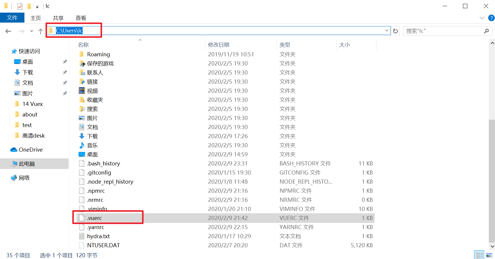
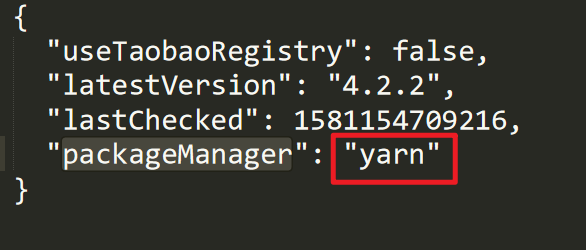

# Vue CLI 默认依赖下载器修改

## 问题

创建 vue 项目不产生 package-lock.json 文件

Vue CLI create 新项目会自动采用 yarn 下载依赖，这样就不会产生 package-lock.json 文件了，这样怎么可以，我的自动部署还是要用到 package-lock.json 的，这可怎么解决呢？

## 解决方法

C:\ => [users] => .vuerc => packageManager 修改成想用的下载器

