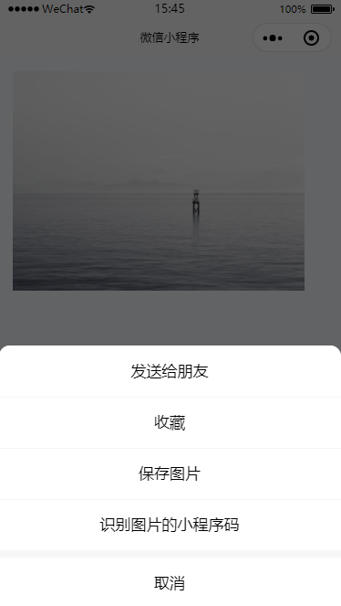
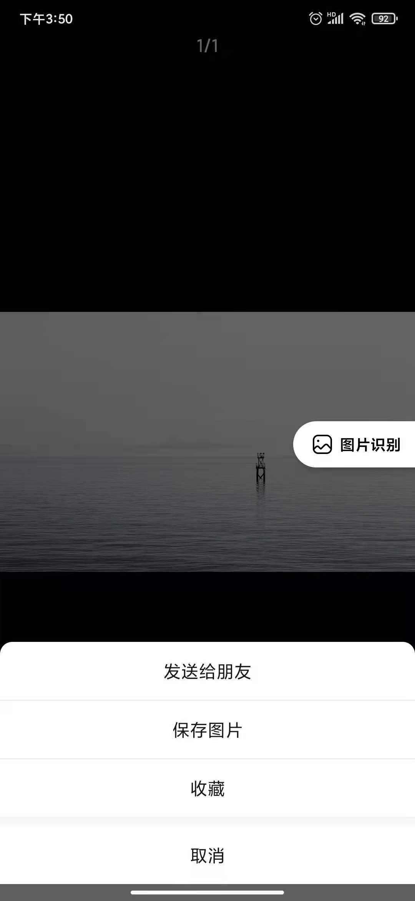

# 小程序内长按分享图片

## 需求

业务需求：每个用户生成一个特定参数的二维码，用户可以将二维码分享给朋友，进行扫码绑定。

## 解决方法

### 方法一

小程序为 `image` 标签预设了 `show-menu-by-longpress` 属性。

添加此属性可以开启图片长按识别弹出框，但需要基础库在 `2.7.0` 版本以上才支持

```html
<image
  src="https://picsum.photos/id/302/1728/1080"
  mode=""
  show-menu-by-longpress
></image>
```



详细问题请查看 [官方文档](https://developers.weixin.qq.com/miniprogram/dev/component/image.html)

### 方法二

可以通过 `wx.previewImage` 方法在新页面中全屏预览图片。预览的过程中用户可以进行保存图片、发送给朋友等操作。

> 接口从基础库版本 `1.9.6` 起支持在小程序插件中使用

```vue
<template>
  <view class="home">
    <image
      src="https://picsum.photos/id/302/1728/1080"
      mode=""
      @click="shareImg"
    ></image>
  </view>
</template>
<script>
export default {
  methods: {
    shareImg() {
      wx.previewImage({
        current: '', // 当前显示图片的http链接
        urls: ['https://picsum.photos/id/302/1728/1080'] // 需要预览的图片http链接列表
      })
    }
  }
}
</script>
```



详细问题请查看 [官方文档](https://developers.weixin.qq.com/miniprogram/dev/api/media/image/wx.previewImage.html)

按业务理解，方法一完美解决问题。关机下班~
