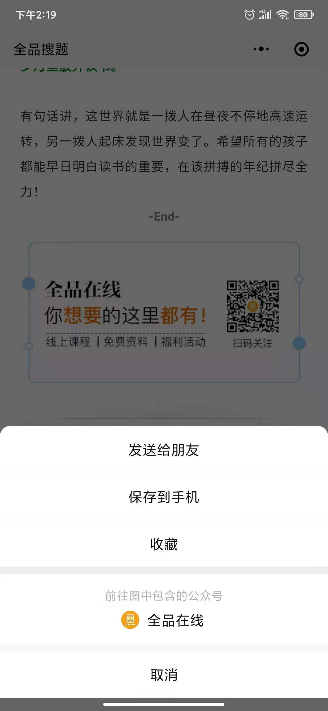

# 小程序内长按识别二维码

## 关于

业务需求：在小程序内长按识别二维码，跳转到公众号关注页面。引导用户关注。

## 解决方法

- 1. `image` 标签有一个 `show-menu-by-longpress` 属性，表示是否开启长按图片显示小程序菜单。

将此属性设置为 `true`，就可以支持长按二维码识别，但是这种方法只能识别菊花码，也就是小程序码，是无法正常识别普通二维码的。

- 2. 可以使用 `<web-view>` 标签来跳转到公众号文章中，在公众号文章中是支持长按识别二维码的。

但是这种方法也是存在限制的，该小程序必须和要关注的公众号是绑定关联的。

设置完成之后就可以做到长按识别了。

