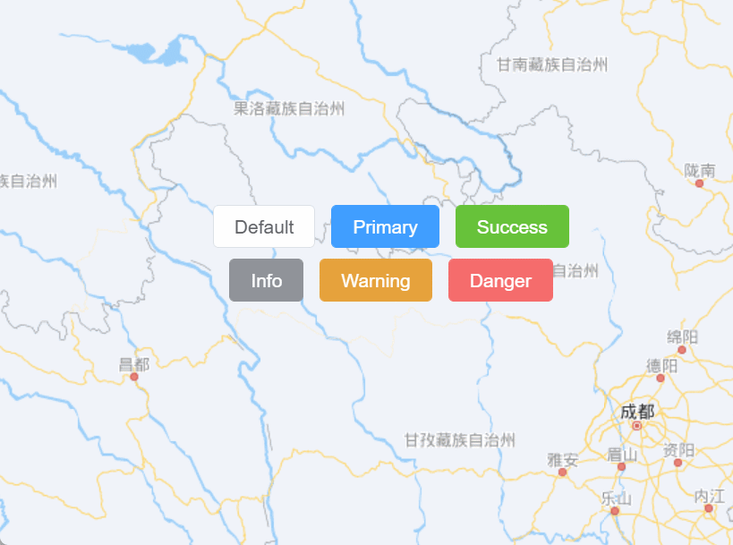

# 悬浮卡片间隙影响背景拖动问题

## 需求

问如题名，先上图



正常布局，这几个按钮应该处于同一容器内，但是点击间隙，事件并不会穿透到底层的 `map` 上。

如果另辟蹊径，选择每一个定位布局，也可以，但是此方法相对不优雅。我们应该迎难而上，干掉穿透问题。

## 解决方法

CSS 提供一个规定鼠标事件的属性 [`pointer-events`](https://developer.mozilla.org/zh-CN/docs/Web/CSS/pointer-events)

该属性大部分特性规定 `SVG only` 但是可以设置 `none` 来取消鼠标事件。

**注意，由于 `pointer-events` 是可继承属性，如果父类设置为 `none`，其子类点击项需手动重置为 `auto` 才可触发 `click event`**

**例：点击背景 alert**

<script setup>
  function handleBG() {
    alert('点击背景')
  }
</script>

<div class="_app">
  <div class="bg" @click="handleBG"></div>
  <div class="list">
    <div class="item">1</div>
    <div class="item">2</div>
  </div>
</div>

<style scoped>
  ._app {
    position: relative;
  }
  .bg {
    width: 100%;
    height: 100px;
    background: gray;
  }
  .list {
    position: absolute;
    top: 20px;
    left: 20px;
    display: flex;
    gap: 20px;
    pointer-events: none; /* 禁用鼠标事件 */
  }
  .item {
    width: 80px;
    padding: 20px;
    background: pink;
    text-align: center;
    pointer-events: auto; /* 重置鼠标事件 */
  }
</style>

**代码块：**

```html 13,20
<style>
  .bg {
    width: 100%;
    height: 100px;
    background: gray;
  }
  .list {
    position: fixed;
    top: 20px;
    left: 20px;
    display: flex;
    gap: 20px;
    pointer-events: none; /* 禁用鼠标事件 */
  }
  .item {
    width: 40px;
    padding: 20px;
    background: pink;
    text-align: center;
    pointer-events: auto; /* 重置鼠标事件 */
  }
</style>
<div class="bg" onclick="handleBG()"></div>
<div class="list">
  <div class="item">1</div>
  <div class="item">2</div>
</div>
<script>
  function handleBG() {
    alert('点击背景')
  }
</script>
```
