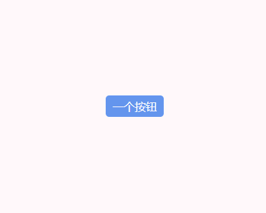

# CSS 实现 Tooltip 效果

## 分享

使用 CSS 来实现组件库中的 Tooltip 文字提醒功能。



> PS：本文主要想介绍 attr() 表达式，Tooltip 小组件是附带功能。如介意，请跳过。😊

## 实现方法

只使用一个 `span` 标签就可以实现上面的功能。

功能实现起来很简单，但是怎么实现动态更改文字呢？

主要通过 CSS 表达式 [attr()](<https://developer.mozilla.org/zh-CN/docs/Web/CSS/attr()>) 来实现。

CSS 表达式 `attr()` 主要用来获取元素的某一 HTML 属性值，并用于其样式。它也可以用于伪元素，属性值采用伪元素所依附的元素。

::: warning 注意
理论上 `attr()` 表达式可以用于所有的 CSS 属性，但目前支持的仅有伪元素的 `content` 属性，其他的属性和高级特性目前是实验性的。 -- 引自 MDN

如果发现浏览器兼容表里 `attr()` 的高级用法依旧没有良好的支持的话，请慎重使用！！！

[点击跳转 MDN 查看兼容性](<https://developer.mozilla.org/zh-CN/docs/Web/CSS/attr()#%E6%B5%8F%E8%A7%88%E5%99%A8%E5%85%BC%E5%AE%B9%E6%80%A7>)
:::

具体使用方法：

```html
<div text-data="我是测试数据"></div>
<span text-data="我也是">测试数据</span>
<style>
  div::after {
    content: attr(text-data); /* 数据来自于自定义属性 */
  }

  span::before {
    content: attr(text-data) '，'; /* attr() 表达式后面还是可以跟其他内容的 */
  }
</style>
```

下面是 Tooltip 小组件实现方法，可以[点击跳转 CodePen 查看效果](https://codepen.io/ares-chang/pen/ExWByYm)。

网址如无法打开可以复制代码块到本地运行。

::: details 点击查看代码块

```html
<!DOCTYPE html>
<html lang="en">
  <head>
    <meta charset="UTF-8" />
    <meta http-equiv="X-UA-Compatible" content="IE=edge" />
    <meta name="viewport" content="width=device-width, initial-scale=1.0" />
    <title>Document</title>
    <style>
      body {
        text-align: center;
        margin-top: 200px;
      }

      .btn {
        position: relative;
        background-color: #6495ed;
        padding: 5px 10px;
        border-radius: 5px;
        font-size: 16px;
        color: #ffffff;
        user-select: none;
      }

      .btn::before {
        content: attr(tip-data);
        width: 100%;
        padding: 5px 10px;
        border-radius: 5px;
        font-size: 14px;
        background-color: #585e6b;
        position: absolute;
        top: -30px;
        left: 50%;
        transform: translateX(-50%);
        opacity: 0;
        transition: all 0.3s;
      }

      .btn::after {
        content: '';
        border: 8px solid transparent;
        border-top: 8px solid #585e6b;
        position: absolute;
        top: -3px;
        left: 50%;
        transform: translateX(-50%);
        opacity: 0;
        transition: all 0.3s;
      }

      .btn:hover::before {
        top: -40px;
        opacity: 1;
      }

      .btn:hover::after {
        top: -13px;
        opacity: 1;
      }
    </style>
  </head>

  <body>
    <span class="btn" tip-data="点击呼叫">一个按钮</span>
  </body>
</html>
```

:::
