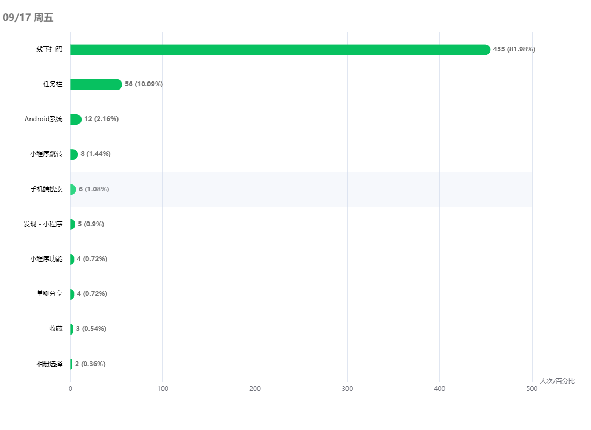

# 类微信小程序数据统计图表分享

## 关于

由于业务需示，需要仿照微信后台统计模块开发相应功能。

前端展示构造图基本相似，但是在 [ECharts](https://echarts.apache.org/zh/index.html) 官网并没有相似风格，社区分享中也没有找到大体相似的，所以只能自己修改一份，同时也上传了社区分享，如果需要可自行修改。

> PS: ECharts 官网更新之后，为什么社区资源不好用了？？没人维护了吗？

## 分享

### 折线图

[社区分享地址，点击查看](https://www.makeapie.com/editor.html?c=xEpyKZC2rx)

### 柱状图

[社区分享地址，点击查看](https://www.makeapie.com/editor.html?c=xhbQRMRslb)

如需修改，请自行查看 [ECharts 配置项手册](https://echarts.apache.org/zh/option.html#title)
