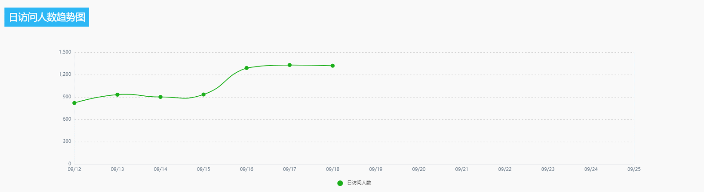

# 解决鼠标悬停借位问题

## 问题

最近业务需要使用的 ECharts 图表做展示，但是引入后发现图表中出现了鼠标经过选中错位的情况。

如下所示：



这可是个大问题？？？也不能这么交工啊，怎么解决？

## 解决方法

排查半天也没找到问题所在，但是功能移动到别的项目又是完好的。

没办法只能再一点一点的找，最后找到问题出现在了 `body` 的一层全局 `zoom` 样式上。

```css
body {
  zoom: 90%;
}
```

`zoom` 取消，功能修复。

但是也不能取消 `zoom` 样式，别处还是需要使用这个功能的。

只能在 ECharts 的父标签上放大同样的 `zoom` 以解决这个问题。

```css
main {
  /* ECharts 父级 */
  zoom: 110%;
}
```
