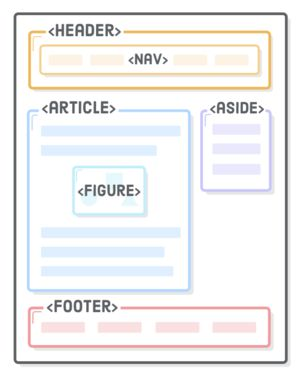

# 标签语义化

## 什么叫标签语义化

> Semantics is the study of the meanings of words and phrases in a language. - w3schools.com

简单点来说，就是为了让别人一目了然的读懂你的代码结构

## 语义化的结构



上面的图示分别为：

- `<header>`头部栏（如：Logo，标题）
- `<nav>`导航（如：各个部分的链接）
- `<article>`文章（如：独立的一篇文章）
- `<figure>`流内容（如：图像、图表、照片、代码）
- `<aside>`侧边栏（如：相关信息，广告）
- `<footer>`底部栏（如：作者信息，联系信息）

要实现上面这个页面的结构，我们可以使用两种方法实现。一种是语义化的，一种是非语义化的。

语义化 HTML 代码

```html
<header>
  <nav></nav>
</header>
<article>
  <figure></figure>
</article>
<aside></aside>
<footer></footer>
```

非语义化 HTML 代码

```html
<div id="header">
  <div id="nav"></div>
</div>
<div id="article">
  <div id="figure"></div>
</div>
<div id="aside"></div>
<div id="footer"></div>
```

你可能认为，都可以实现，我为什么要另外去记一些单词呢，`<div>`不香吗？

但是你有没有想过，这只是一个简单的 demo，如果是网站项目呢？

想想光是为所有的`<div>`取个 id 就够我们头疼的了，哪里还会去顾忌什么头部，什么导航栏呢？

这时候，我们就需要用到 HTML5 里面的 **语义元素** 来构建网页。浏览器会根据你写的代码来分辨，这块儿是头部，这块儿是 nav 导航，这块是主体结构，而不会全部认为，这就是一个未知的 div 盒子，对里面内容一无所知

## 语义化的好处

1. 有利于 SEO (Search engine optimization)

   - SEO 就是 搜索引擎优化 的意思，目的是为了让你的网页容易的被用户搜索到。

2. 代码可读性更高

   - 让你的同事小伙伴更好的理解你的代码结构

3. 访问性更好

   - 当 CSS 样式不能正常工作的时候，被语义化包裹的 HTML 代码布局不会错位

4. 可维护性更高

   - 更加容易确认错误位置

W3C 组织提倡大家使用正确的语义化结构，这样让我们的使用更加贴近于规则
