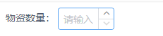

# InputNumber 默认显示占位符

## 问题

`InputNumber` 组件设置了 `placeholder` 默认值，但是不生效。

业务需求：默认不设置值，显示 `placeholder` 设置的文字。



## 解决方法

其实组件设置 `placeholder` 属性并不是没有成功，把组件中的数字删除之后还是会出现预设文字。

但是因为组件 `v-model` 默认绑定了一个值，系统判定有值输入不显示占位符。

只需要把这个值设置为 `null` 就可以解决这个问题。

```vue
<template>
  物资数量：
  <InputNumber
    :max="10"
    :min="1"
    v-model="value1"
    placeholder="请输入"
  ></InputNumber>
</template>
<script>
export default {
  data() {
    return {
      value1: null // 这里设置为空就可以解决
    }
  }
}
</script>
```

[测试链接，点击直达 View UI Run](https://run.iviewui.com/)
