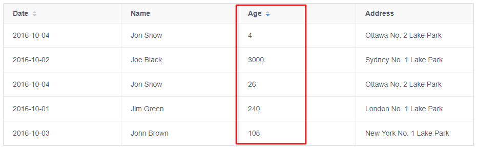
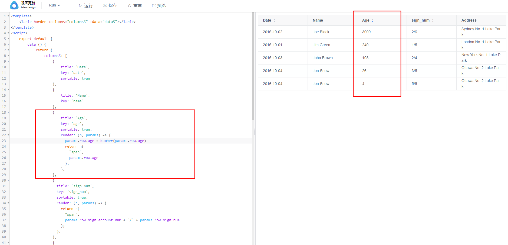
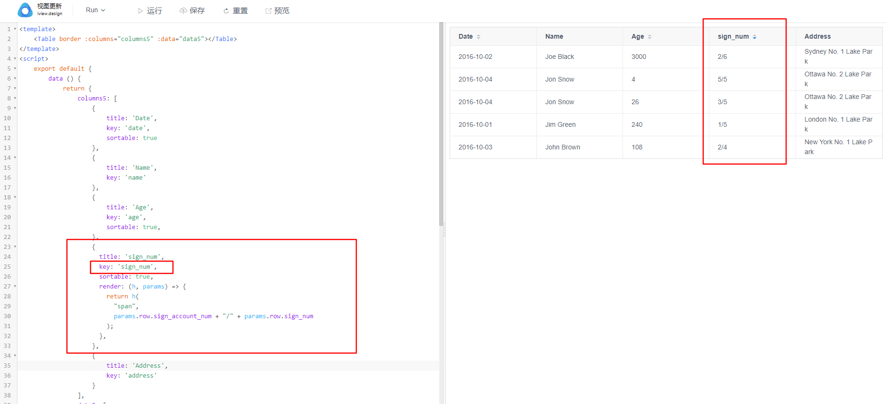

# table 表格中排序错乱问题

## 问题

在使用 ViewUI 的 table 表格排序功能的时候，排出来的序列是乱序的，并没有达到预期的排序效果。

## 产生原因

经核实，后台返回数据格式为 `String` 类型，导致排序失败。

字符串类型排序默认按照 `ASCll` 逐字对比进行排序，所以会产生排序错乱，不是正序也不是倒叙的问题

## 解决方法

1. 后台更改数据返回格式

2. 前端自行 `Number()` 一下或者 `*1` 把字符串类型转换一下在排序,

注意：`table` 排序是根据设置的 `key` 值进行的，所以如果要转换字段类型请直接转换原值，不要转换用于展示的字段。

同样如果需要自行拼装数据展示方式并排序，请确认好 `key` 值的对应字段是否正确

