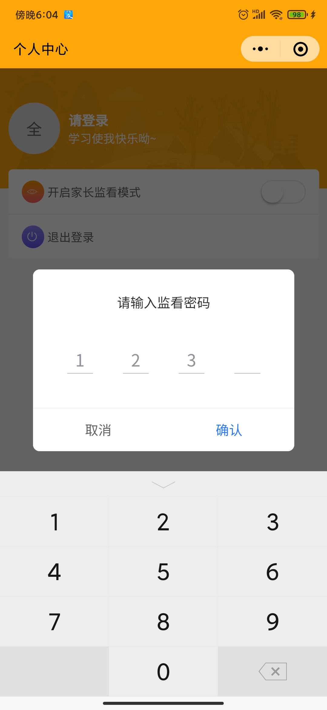
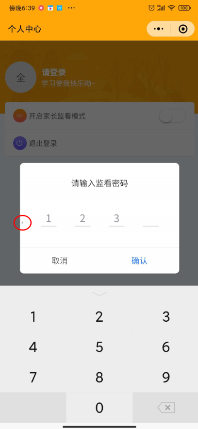
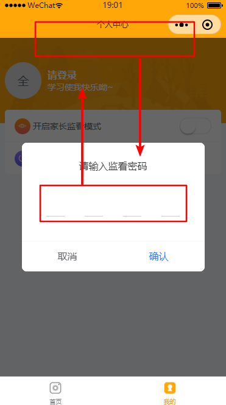

# 实现点击输入密码弹窗

## 业务需求

业务需求：自定义密码输入展示弹窗

## 实现思路

1. 使用 `li` 标签更改 `css` 模拟实现 `_` 效果。

2. 把 `input` 标签定位到 `li` 标签之上，保证用户可以点击触发数字键盘

3. 把 `input` 标签及其内容隐藏

## 解决流程

本项目使用 `uni-app` 框架搭建的小程序项目，实现过程执行到第 3 步无法把 `input` 内容彻底隐藏，现已解决，记录一下，防止下次踩坑。

实现过程：

- 第一次实现把 `input` 的 `opacity` 属性调为 0 设置透明，但是光标和文字并没有如愿隐藏。失败!

- 第二次实现把 `input` 的 `font-size` 属性调为 `0.1rpx` 并把 `color` 设置为 白色, 但是手机上显示会存在一个微小光标跟随移动。失败!

- 第三次实现动态设置 `input` 具体顶部距离，设置 `input` 聚焦状态 `top: -1000px;` 失去焦点 `top` 回归，运行在安卓设备完美实现(得意洋洋.jpg), 但是运行到 `ios` 设备却无法找到 `input` 无法进入键盘。失败!

- 第四次实现通过谷歌查询，可以使用 `text-indent: -999rpx;` 来隐藏文字显示，通过 `margin-left: -100%;` 来隐藏 `input` 光标，完美实现需求 成功 Nice~
