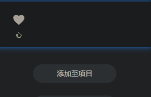
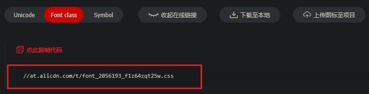
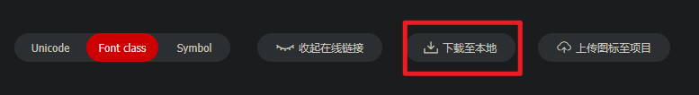
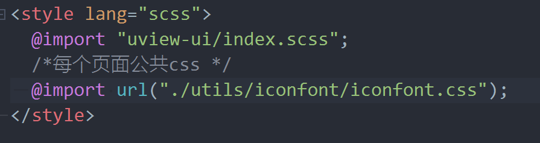
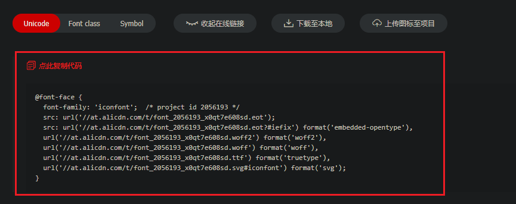
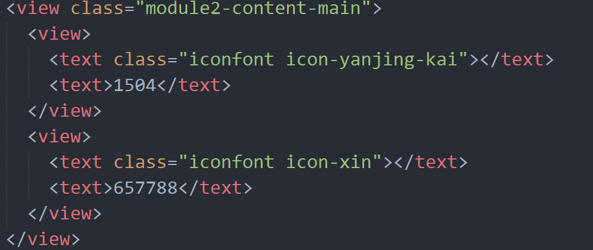

# 微信小程序内使用阿里图标库

## 关于

想要在 wx 小程序内使用阿里巴巴图标库，但是微信小程序内是没有 `index.html` 文件的，怎么引入在线地址使用呢？

## 使用示例

1. 挑选想要使用的图标加入到购物车内

2. 将要使用的图标添加到项目中

3. 将代码下载到本地

### 方法一

- 直接将代码在线打开，另存为下载，导入项目，方可直接使用。(这个最方便 😁)

### 方法二

- 点击下载代码，下载 zip 压缩包

- 下载的代码中有个 `iconfont.css` 的文件，将文件复制到你的项目中

- 然后在你的 `App.vue` 文件中引入 `iconfont.css`

- 因为下载到你本地的代码资源使用的是你本地路径，需要更改为你的线上地址。

打开阿里图标库，选中 `Unicode` 点击打开在线链接，复制生成代码替换你本地 `@font-face` 代码块。

保存之后就可以正常使用了。

代码：

效果：

::: details 不完美的方案

ps2: 图标直接下载，之所以无法使用，是因为 `src` 无法找到这些兼容文件，我们可以直接删除这些无法找到的兼容文件引入，也可以解决，但是可能不是那么完美。

删除多余的 `url` 引入，只保留 `format('woff2')` 这一项就可以解决。

记得把 `"src: url('data:application/x-font-woff2......"` 最后的逗号 `,` 改成分号 `;`。

:::
