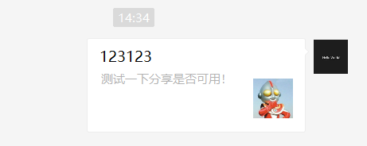

# H5 页面自定义微信分享

## 注意

本文不是讲小程序分享的，是处理 H5 项目自定义微信分享内容的。

如果要处理[小程序分享](./wx-share.md)，请点击查看。

## 关于

这两天产品提出问题，

我们的 M 站 在微信中分享出去的链接头图是空白的，还有网址链接，非常的不美观。

需要改一改，要实现这样的效果：



## 解决方法

解决方法也简单，只要通过 wx 开放能力，调用 wx 的开放 `api` 暴露一下就可以解决这个问题。

微信的 [JS-SDK 官方文档](https://developers.weixin.qq.com/doc/offiaccount/OA_Web_Apps/JS-SDK.html)这部分描写的非常的全，如果不想继续往下看也可以仔细读一下[官方文档](https://developers.weixin.qq.com/doc/offiaccount/OA_Web_Apps/JS-SDK.html)。

::: warning 注意：
下列测试需要线上环境才可以运行。

运行需要线上域名并通过 ICP 备案的验证，无法使用本地地址运行。
:::

**下面是详细步骤，也可跳转到底部查看[详细代码块](#详细代码块)：**

### 绑定域名

微信的开放能力需要在公众号后台绑定指定域名才可以访问，

没有绑定的域名是无法调通开放接口的。

**绑定路径：**

登录公众号后台，依次点击 "设置与开发" -> "公众号设置" -> "功能设置" -> 在 "JS 接口安全域名" 中填写自己的项目网址。

开发过公众号或者小程序的肯定都了解绑定位置。

### 接入 JS-SDK

JS-SDK 有两种引入方式，可以通过 在线地址引入 或者 模块化加载。

**在线地址引入：**

在需要调用 JS 接口的页面引入如下 JS 文件，http://res.wx.qq.com/open/js/jweixin-1.6.0.js (支持 https)

**模块化引入：**

可以通过 `npm` 或者 `yarn` 来安装

```shell
npm install weixin-js-sdk

# yarn add weixin-js-sdk
```

在需要的文件中 `import wx from 'weixin-js-sdk'` 引入即可。

### 获取 config 鉴权

微信规定：

所有需要使用 JS-SDK 的页面必须先注入配置信息，否则将无法调用（同一个 url 仅需调用一次，对于变化 url 的 SPA 的 web app 可在每次 url 变化时进行调用,目前 Android 微信客户端不支持 pushState 的 H5 新特性，所以使用 pushState 来实现 web app 的页面会导致签名失败，此问题会在 Android6.2 中修复）。

```js
wx.config({
  debug: true, // 开启调试模式,调用的所有api的返回值会在客户端alert出来，若要查看传入的参数，可以在pc端打开，参数信息会通过log打出，仅在pc端时才会打印。
  appId: '', // 必填，公众号的唯一标识
  timestamp: , // 必填，生成签名的时间戳
  nonceStr: '', // 必填，生成签名的随机串
  signature: '',// 必填，签名
  jsApiList: [] // 必填，需要使用的JS接口列表
});
```

签名信息需要后端通过 wx 接口进行计算，详细签名计算可以参考 [官方文档附录 1](https://developers.weixin.qq.com/doc/offiaccount/OA_Web_Apps/JS-SDK.html#62)

### 通过 ready 接口处理成功验证

```js
wx.ready(function () {
  /**
   * config 信息验证后会执行 ready 方法，所有接口调用都必须在 config 接口获得结果之后。
   * config 是一个客户端的异步操作，所以如果需要在页面加载时就调用相关接口，
   * 则须把相关接口放在 ready 函数中调用来确保正确执行。
   * 对于用户触发时才调用的接口，则可以直接调用，不需要放在 ready 函数中。
   */
})
```

### 通过 error 接口处理失败验证

```js
wx.error(function (res) {
  /**
   * config 信息验证失败会执行 error 函数，如签名过期导致验证失败，
   * 具体错误信息可以打开 config 的 debug 模式查看，
   * 也可以在返回的 res 参数中查看，对于 SPA 可以在这里更新签名。
   */
})
```

### 接口调用说明

所有接口通过 wx 对象(也可使用 jWeixin 对象)来调用，参数是一个对象，除了每个接口本身需要传的参数之外，还有以下通用参数：

1. success：接口调用成功时执行的回调函数。
2. fail：接口调用失败时执行的回调函数。
3. complete：接口调用完成时执行的回调函数，无论成功或失败都会执行。
4. cancel：用户点击取消时的回调函数，仅部分有用户取消操作的 api 才会用到。
5. trigger: 监听 Menu 中的按钮点击时触发的方法，该方法仅支持 Menu 中的相关接口。

备注：不要尝试在 trigger 中使用 ajax 异步请求修改本次分享的内容，因为客户端分享操作是一个同步操作，这时候使用 ajax 的回包会还没有返回。

以上几个函数都带有一个参数，类型为对象，其中除了每个接口本身返回的数据之外，还有一个通用属性 errMsg，其值格式如下：

**调用成功时："xxx:ok" ，其中 xxx 为调用的接口名**

用户取消时："xxx:cancel"，其中 xxx 为调用的接口名

**调用失败时：其值为具体错误信息**

> 失败时返回的 code 因为官方没有提供参考，只能遇到一个百度一个。

### 分享接口

> 请注意，不要有诱导分享等违规行为，对于诱导分享行为将永久回收公众号接口权限，详细规则请查看：[朋友圈管理常见问题](https://kf.qq.com/faq/161223JfINJV1612237buYri.html) -- 官方提示

> 请注意，原有的 `wx.onMenuShareTimeline`、`wx.onMenuShareAppMessage`、`wx.onMenuShareQQ`、`wx.onMenuShareQZone` 接口，即将废弃。请尽快迁移使用客户端 6.7.2 及`JSSDK 1.4.0`以上版本支持的 `wx.updateAppMessageShareData`、`wx.updateTimelineShareData`接口。 -- 官方提示

#### 自定义“分享给朋友”及“分享到 QQ”按钮的分享内容（1.4.0）

```js
wx.ready(function () {
  //需在用户可能点击分享按钮前就先调用
  wx.updateAppMessageShareData({
    title: '', // 分享标题
    desc: '', // 分享描述
    link: '', // 分享链接，该链接域名或路径必须与当前页面对应的公众号JS安全域名一致
    imgUrl: '', // 分享图标
    success: function () {
      // 设置成功
    }
  })
})
```

#### 自定义“分享到朋友圈”及“分享到 QQ 空间”按钮的分享内容（1.4.0）

```js
wx.ready(function () {
  //需在用户可能点击分享按钮前就先调用
  wx.updateTimelineShareData({
    title: '', // 分享标题
    link: '', // 分享链接，该链接域名或路径必须与当前页面对应的公众号JS安全域名一致
    imgUrl: '', // 分享图标
    success: function () {
      // 设置成功
    }
  })
})
```

## 详细代码块

上方整理复述了一遍官方文档，可以选择跳过不看。

下方是详细代码块，可供参考。

```js
import axios from '@/utils/http' // 这里是做了封装。
import wx from 'weixin-js-sdk'
import { XXX } from '@/utils/url'

const BASIC_CONFIG = {
  title: '默认title',
  desc: '默认desc',
  imgUrl: '默认imgUrl'
}
/**
 * 微信 sdk 签名鉴权引入
 *
 * 自定义分享给朋友
 *
 * @param {Object} {} 对象传值，如果不传，设置 BASIC_CONFIG 默认属性。
 */
export const config = async ({
  title = BASIC_CONFIG.title,
  desc = BASIC_CONFIG.desc,
  imgUrl = BASIC_CONFIG.imgUrl
} = BASIC_CONFIG) => {
  let res = await axios({
    // 请求获取签名信息
    url: XXX,
    params: {
      url: location.href.split('#')[0] // 签名中不能包含 # hash 路由之后的参数
    }
  })

  if (res.data.code !== 200) {
    console.log('签名失败！')
    return false
  }

  const { appId, nonceStr, signature, timestamp } = res.data.data
  wx.config({
    debug: true, // 开启调试模式,调用的所有api的返回值会在客户端alert出来，若要查看传入的参数，可以在pc端打开，参数信息会通过log打出，仅在pc端时才会打印。
    appId, // 必填，公众号的唯一标识
    timestamp, // 必填，生成签名的时间戳
    nonceStr, // 必填，生成签名的随机串
    signature, // 必填，签名
    jsApiList: ['updateAppMessageShareData'] // 必填，需要使用的JS接口列表
  })

  wx.ready(function () {
    // 需在用户可能点击分享按钮前就先调用
    wx.updateAppMessageShareData({
      // 分享给朋友
      title, // 分享标题
      desc, // 分享描述
      link: location.href, // 分享链接，该链接域名或路径必须与当前页面对应的公众号JS安全域名一致
      imgUrl,
      success: function () {
        console.log('成功!')
        // 设置成功
      }
    })
  })

  wx.error(function (res) {
    console.log('失败:', res)
    // config信息验证失败会执行error函数，如签名过期导致验证失败，具体错误信息可以打开config的debug模式查看，也可以在返回的res参数中查看，对于SPA可以在这里更新签名。
  })
}
```

因为没有想到好办法直接把分享应用到全局并实现产品需求，

所以退而求其次，选择把 `config` 绑定到 `this` 上，在需要的页面调用。

> PS：如果有实现全局应用分享的方法，请提供，万分感谢！

```js
/**
 * main.js
 */

// 微信开放能力引入
import * as wxOpen from './uilt/wxOpen'
Vue.prototype.$wx = wxOpe
```

**调用：**

```vue
<template>
  <div class="test">测试用例！</div>
</template>

<script>
export default {
  data() {
    return {}
  },
  created() {
    this.$wx.config({
      title: '分享测试用例！',
      desc: '测试一下分享是否可用！',
      imgUrl: 'http://areschang.top/hero.jpg'
    }) // 自定义参数

    // this.$wx.config({
    //   desc: "测试只会desc",
    // }); // 部分默认参数

    // this.$wx.config();  // 默认参数
  }
}
</script>
```

> 由于微信 api 要求，测试操作必须要在线上进行，请知悉。
>
> 但是在微信开发者工具中是可以进行分享操作的，只是不完善。
>
> 分享时可以查看 `title` 是否设置，如果设置成功，上线测试问题不大。
