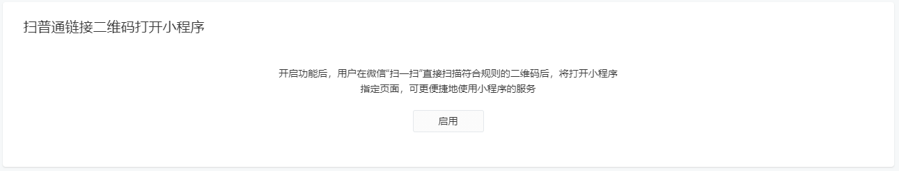
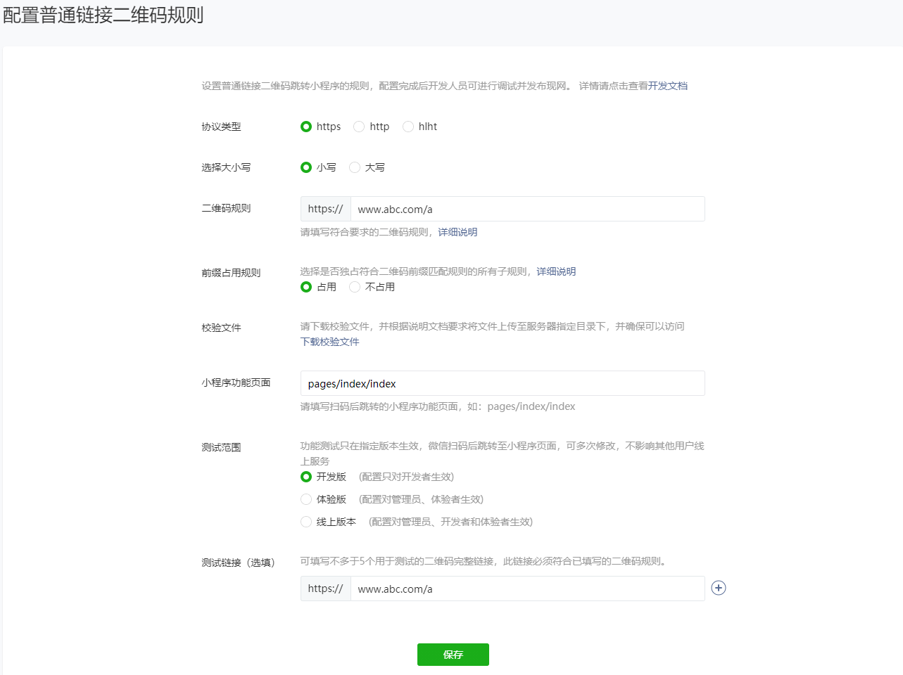
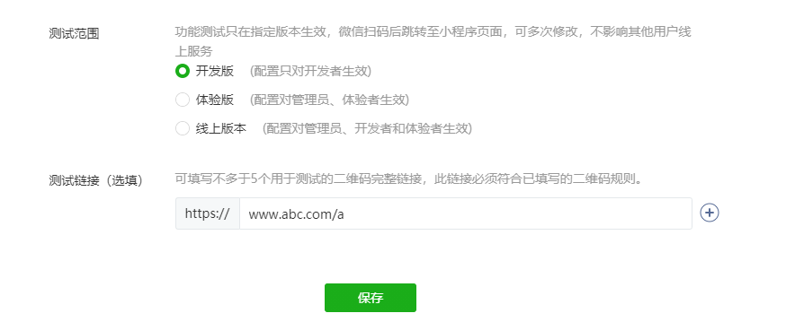

# 扫描普通二维码打开小程序

## 关于

业务需求：为了更好的推广自家产品，需求兼容扫描普通二维码打开小程序的能力。

需注意：该功能只支持微信"扫一扫"和微信内长按识别二维码

以下为踩坑体验，具体配置可查看[官方文档](https://developers.weixin.qq.com/miniprogram/introduction/qrcode.html#%E5%8A%9F%E8%83%BD%E4%BB%8B%E7%BB%8D)

## 实现步骤

1. wx 后台打开开发模块 -> 开发设置 -> 启用

2. 点击添加，设置截取链接规则

规则介绍：

微信扫描二维码后会在配置中查找，如符合配置则可以打开小程序，如不符合，照常访问 H5 页面

如现在设置的 `https://www.abc.com/a` 如果访问 `https://www.abc.com/abc` 是访问不通的，但是访问 `https://www.abc.com/a?123` 是可以打开小程序的。

微信的访问规则是匹配前面的访问路径，如果路径正确，可以访问，如果路径不正确是访问不通的。

> 自 2017 年 5 月开始，微信客户端支持二维码规则根据“子路径匹配”。如原有二维码链接为 `http://www.qq.com/a/123456` ，其中 12345 为业务参数，则可配置规则 `http://www.qq.com/a/` 实现扫码打开小程序。

:::danger 注意
 

这个地方只限于测试，不会影响到线上，不是只能设置 100(20\*5) 个码！！！(我恨自己没有多长几双眼睛去看清 wx 的文档，语文阅读理解没有得满分。就不能换个显眼的字体颜色吗？开个黑背景什么也看不清 😡)
:::

如服务器未放置校验文件无法创建成功哦~

3. 添加成功之后还需要手动发布一下

配置发布成功之后会在 5 分钟之内生效，请不要马上扫描测试，会失败！血泪史！！!😭

4. 成功进入小程序之后，页面所携带的参数可以在 onLoad() 事件中提取 q 参数自行 `decodeURIComponent` 一次，获取原二维码完整内容。
