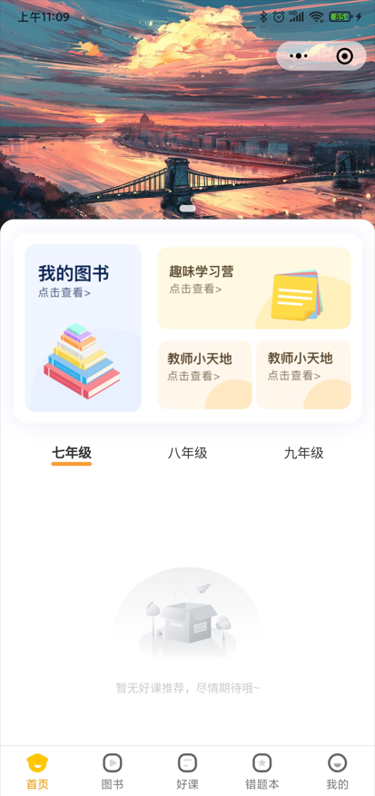

# 去除默认导航栏

## 关于

近日，设计发布新需求：主页要设置一个轮播图，但是这个图片要覆盖到导航栏，这样的效果才好看。

具体效果是这样的：



## 解决方法

查了一下，在[微信文档页面配置项](https://developers.weixin.qq.com/miniprogram/dev/reference/configuration/page.html#%E9%85%8D%E7%BD%AE%E9%A1%B9)中有个 `navigationStyle` 属性可以解决这个问题。

| 属性            | 类型   | 默认值  | 描述                                                                                                          | 最低版本                                               |
| :-------------- | :----- | :------ | :------------------------------------------------------------------------------------------------------------ | :----------------------------------------------------- |
| navigationStyle | string | default | 导航栏样式，仅支持以下值：<br/>`default` 默认样式<br/>`custom` 自定义导航栏，只保留右上角胶囊按钮。参见注 1。 | iOS/Android 微信客户端 7.0.0，Windows 微信客户端不支持 |

- 注 1：关于 `navigationStyle`
  - iOS/Android 客户端 7.0.0 以下版本，`navigationStyle` 只在 `app.json` 中生效。
  - iOS/Android 客户端 6.7.2 版本开始，`navigationStyle: custom` 对 `web-view` 组件无效
  - 开启 `custom` 后，低版本客户端需要做好兼容。开发者工具基础库版本切到 1.7.0（不代表最低版本，只供调试用）可方便切到旧视觉
  - Windows 客户端 3.0 及以上版本，为了给用户提供更符合桌面软件的使用体验，统一了小程序窗口的导航栏，`navigationStyle: custom` 不再生效

如果使用的 `uni-app` 构架，可以直接在 `pages.json` 文件中进行修改。

直接在当前路由 `style` 属性中添加 `"navigationStyle": "custom"`，就可以取消默认导航栏。

**代码块：**

```json
{
  "pages": [
    {
      "path": "pages/index/index",
      "style": {
        "enablePullDownRefresh": true, // 下拉刷新开启
        "navigationStyle": "custom" // 取消默认导航栏
      }
    }
  ]
}
```

打完收工，又水一期，真棒呢~
