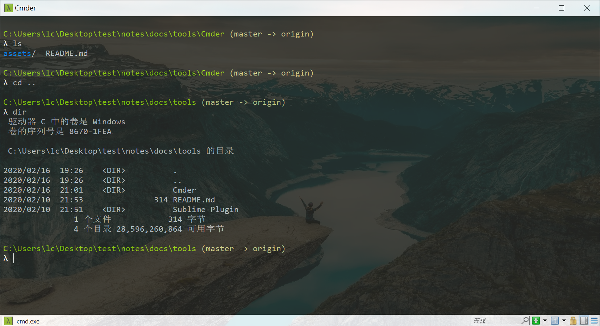
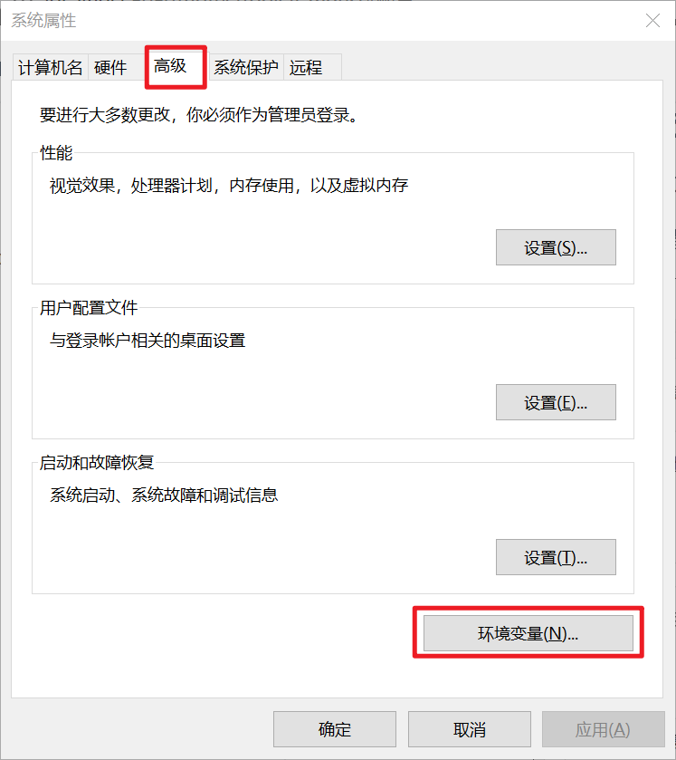
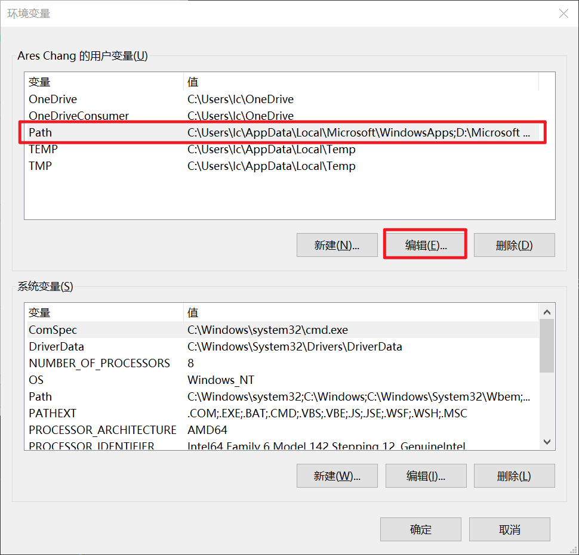
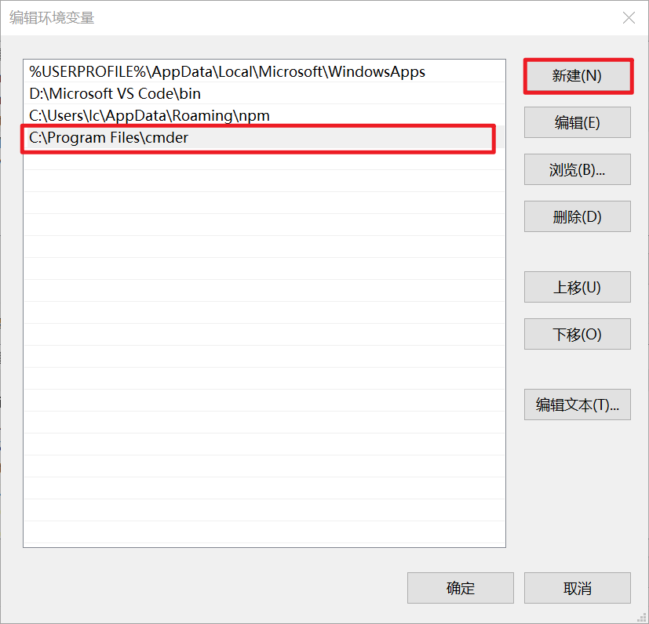
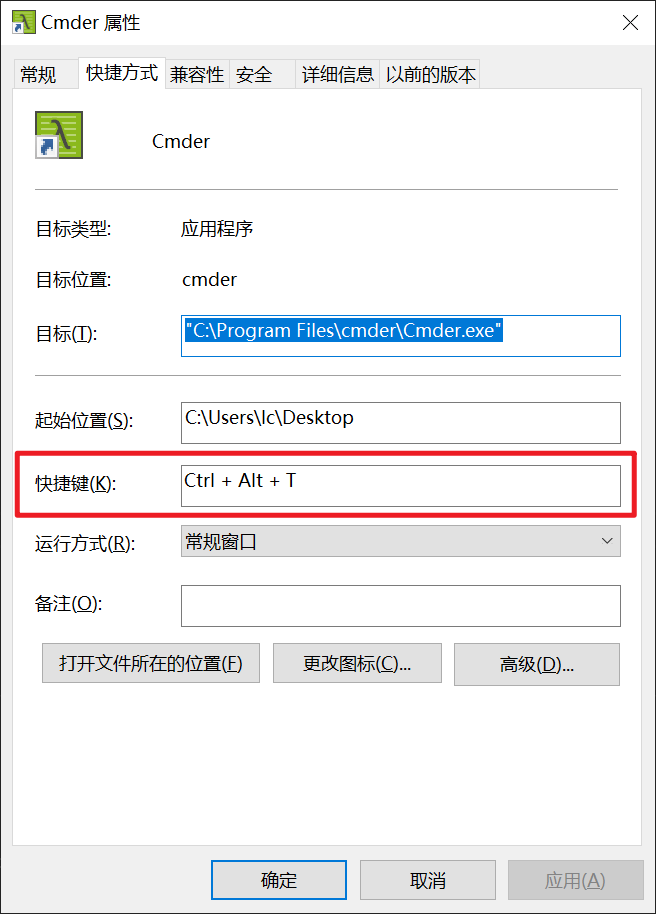
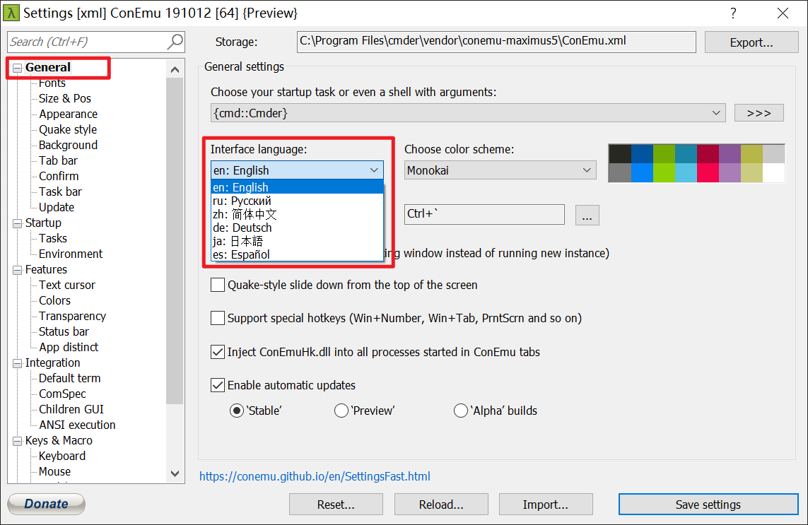

# Cmder

## 介绍

[Cmder](https://cmder.net/)被广大知乎网友亲切的称为 “Windows 上的程序员神器”。

相信只要做为程序员就是离不开 shell 的。

想我左手拿着 cmd 右手抄着 git bash，两手操作，就很烦~

于是乎，Cmder 就出现在了我的鼠标右键上

> PS: 主要颜值真的不在线。

#### 放下我的 Cmder



## 安装

Cmder 作为一个压缩版的存在，可以解压即用。你可以放在 U 盘里随身携带，甚至连调整过的设置文件都在目录下面，不会出现换个电脑就要重新设置调整的问题。

[Cmder](https://cmder.net/)下载的时候分为两个版本, Mini 版(9.1MB)和 Full 版(118MB)。唯一的差别在于有没有内建 msysgit 工具，这是 Git for Windows 的标准配备。

> Cmder 还可以使用大量 Linux 命令哦~

## 配置

Cmder 是解压即用的软件，你当然可以安装完双击使用。

但是！我们要做一个有极客精神的程序员。这么没有逼格的事情我们怎么能干呢？

### 设置环境变量

把 Cmder 设置为环境变量后，我们就可以直接 win + R 输入 cmder 打开了

点击 win 键，查询环境变量，打开系统属性，点击环境变量



选择 Path 点击编辑



点击新建，输入你 Cmder.exe 所有的文件夹



现在 Win + R 输入 cmder 测试一下是否可以打开

### 把 Cmder 添加到右键

右键打开 Cmder,这是个刚需。一句代码就能实现了。

现在点击 win + X 选择管理员模式打开 Windows PowerShell 输入以下内容

```bash
Cmder.exe /REGISTER ALL
```

现在回到文件夹点击右键就能打开 Cmder 了

> 如果要删除右侧，Win + R 输入 regedit 打开注册表，查找 cmder 把对应注册文件夹删除就可以了。

### 设置自定义快捷键打开

Ctrl + Alt + T 快捷打开，你值得拥有。

首先设置一个桌面快捷方式，点击属性，设置你想用的快捷键。



注意哦~ 这个方式有个 BUG ，设置的快捷键打开有 3s 左右的延迟效果。

### 设置中文

打开 Cmder 点击 win + Alt + P 打开设置，选择简体中文。



接下来就是你们的时间了~
